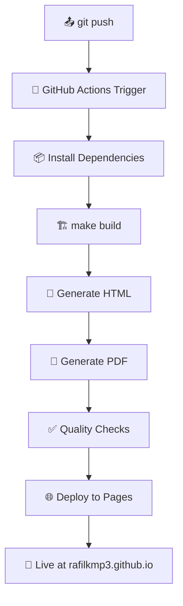

<div align="center">

# 🚀 Resume as Code
### Rafael Bernardo Sathler

**Platform Engineering Portfolio Project**

[](https://rafilkmp3.github.io/resume-as-code/)
[](https://rafilkmp3.github.io/resume-as-code/resume.pdf)
[](https://github.com/rafilkmp3/resume-as-code/actions)

*A modern, automated resume generation system showcasing DevOps and Platform Engineering best practices through infrastructure-as-code principles applied to personal branding.*

[🎯 Features](#-features) • [🛠️ Quick Start](#️-quick-start) • [📋 Commands](#-make-commands-reference) • [🚀 Architecture](#-architecture-highlights) • [🔗 Live Demo](https://rafilkmp3.github.io/resume-as-code/)

</div>

---

This is a resume-as-code project, built with Node.js, Handlebars, and Puppeteer.

<details>
<summary><strong>🏆 Professional Highlights</strong></summary>

<br>

**11+ years** of Platform Engineering excellence:

- 🏆 **Guinness World Record** - Zero-downtime infrastructure for record-breaking traffic
- 💰 **Major Cost Optimization** - $65K+ annual savings through automation  
- 📈 **Enterprise Scale** - Supporting 5,000+ engineers and 8,000+ repositories
- 🚀 **Platform Leadership** - Building self-service infrastructure at Uber and Bluecore

</details>

## ✨ Technical Showcase

<table>
<tr>
<td width="50%">

**🔧 Developer Experience**
- Comprehensive Makefile with intuitive commands
- Smart port management and conflict resolution
- Live reload and file watching capabilities
- Color-coded build output and status reporting

**⚡ Automation & CI/CD** 
- One-command build, serve, and deployment pipeline
- GitHub Actions for automated deployment
- Continuous integration with quality checks
- Infrastructure-as-code principles

**🧪 Testing & Quality Assurance**
- Comprehensive mobile testing with Playwright
- Visual regression testing across 12+ screen sizes
- Accessibility testing with axe-core (WCAG compliance)
- Performance testing with Core Web Vitals monitoring
- Auto-fix scripts for common mobile layout issues

</td>
<td width="50%">

**📄 Document Generation**
- Advanced PDF rendering with Puppeteer
- Print-optimized typography and layouts
- ATS-friendly plain text export
- Cross-platform compatibility

**📱 Mobile-First Design**
- Touch-optimized UI with 44px minimum targets
- Responsive breakpoints from 320px to 4K displays
- iOS and Android design guideline compliance
- Dark/light theme with OS preference detection
- Professional animations and interactive elements

**🖼️ Asset Optimization**
- Automated image processing and optimization
- Organized asset directory structure
- WebP format recommendations for better compression
- Responsive image sizing for different screen densities

</td>
</tr>
</table>

## 🎯 Features

- **📱 Responsive Web Resume**: Mobile-optimized professional layout
- **📄 High-Quality PDF Export**: Print-ready PDF with proper typography  
- **🌙 Dark/Light Theme**: Auto-detecting OS preference with manual override
- **📋 ATS-Friendly Export**: Plain text version for applicant tracking systems
- **🔗 Interactive Elements**: Direct contact links and social profiles with official logos
- **⚡ Fast Development**: Live reload and file watching capabilities
- **📊 Professional Analytics**: Clean, structured data presentation

## 🛠️ Quick Start

### 📥 Clone & Setup

```bash
# Clone the repository
git clone https://github.com/rafilkmp3/resume-as-code.git
cd resume-as-code

# Install dependencies (requires Node.js 16+)
make install

# Start development with live reload
make dev
```

> **💡 Pro Tip:** This project leverages **Make** for superior developer experience. All workflows are optimized for productivity and eliminate common development friction!

<table>
<tr>
<td width="50%">

### 🚀 Development Workflow

```bash
# 🎯 View all available commands
make help

# 🏗️ Build and serve with auto port-cleanup
make dev

# ✨ Live development with file watching
make live

# 📊 Check project health and status
make status

# 🧪 Run comprehensive testing suite
make test

# 📱 Quick mobile layout tests
make test-quick

# 🔧 Auto-fix mobile layout issues
make fix-layout
```

**Smart Features:**
- ⚡ Auto-kills conflicting processes on port 3000
- 🔄 Live reload on file changes
- 🎨 Color-coded build output
- 📈 Real-time file size reporting
- 🧪 Comprehensive mobile testing across 12+ screen sizes
- 🔧 Automated mobile layout fixes

</td>
<td width="50%">

### 🔧 Build & Deploy

```bash
# 🧹 Clean build artifacts
make clean

# 📄 Generate HTML + PDF
make build

# 🌐 Serve production build
make serve

# 👀 Watch files (CI-friendly)
make watch
```

**Production Ready:**
- 📱 Mobile-responsive layouts
- 🖨️ Print-optimized PDF generation
- 🚀 GitHub Actions deployment
- ⚡ Optimized asset pipeline

</td>
</tr>
</table>

<details>
<summary><strong>🚨 Why not npm? Make provides superior DX</strong></summary>

<br>

**Make advantages over npm scripts:**
- 🔧 **Smart port management** - Automatically kills conflicting processes
- 📊 **Rich status reporting** - File sizes, port status, system info
- 🎨 **Color-coded output** - Visual feedback for all operations
- 🔄 **Advanced file watching** - Cross-platform compatibility
- ⚡ **Dependency management** - Intelligent rebuild detection
- 🛠️ **Error handling** - Graceful fallbacks and recovery

```bash
# Traditional npm approach (limited)
npm install && npm run build && npm run serve

# Modern Make approach (powerful) 
make dev  # Handles everything intelligently
```

</details>

## 📁 Project Architecture

```
resume-as-code/
├── 📄 resume-data.json        # JSON Resume schema-compliant data
├── 🎨 template.html           # Handlebars template with responsive CSS
├── 🏗️ build.js               # Puppeteer PDF generation engine
├── 📋 Makefile               # Developer experience automation
├── 🚀 .github/
│   └── workflows/
│       └── deploy.yml        # GitHub Actions CI/CD pipeline
├── 🧪 tests/                 # Comprehensive testing suite
│   ├── accessibility/        # WCAG compliance testing
│   ├── e2e/                  # End-to-end testing
│   ├── performance/          # Core Web Vitals monitoring
│   └── visual/               # Visual regression testing
├── 🔧 scripts/               # Automation and optimization scripts
│   ├── auto-fix-layout.js    # Mobile layout auto-fixes
│   └── optimize-images.js    # Image optimization tools
├── 🖼️ assets/
│   └── images/               # Organized asset directory
│       └── rafael-sathler-profile.jpeg  # Optimized profile image
├── 📦 dist/                  # Generated artifacts
│   ├── index.html           # Responsive web resume
│   ├── resume.pdf           # Print-ready PDF export
│   └── rafael-sathler-profile.jpeg  # Profile image asset
├── ⚙️ playwright.config.js   # Testing configuration
└── 📋 package.json           # Node.js dependencies and scripts
```

### 🔧 Core Technologies Deep Dive

<table>
<tr>
<td width="50%">

**🏗️ Build System**
- **[Handlebars.js](https://handlebarsjs.com/)** - Template engine with helper functions
- **[Puppeteer](https://pptr.dev/)** - Headless Chrome for PDF generation
- **[Make](https://www.gnu.org/software/make/)** - Build automation and task runner
- **Node.js 16+** - JavaScript runtime with ES6+ support

**📊 Data & Content**  
- **[JSON Resume](https://jsonresume.org/)** schema compliance
- **Structured data** with semantic markup
- **Asset pipeline** with automated image copying
- **Content validation** and error handling

</td>
<td width="50%">

**🎨 Frontend Stack**
- **CSS Grid & Flexbox** - Modern responsive layouts
- **CSS Custom Properties** - Dynamic theming system
- **Progressive Enhancement** - Core functionality without JS
- **Print Media Queries** - Optimized PDF typography

**🚀 DevOps & Deployment**
- **[GitHub Actions](https://github.com/rafilkmp3/resume-as-code/actions)** - Automated CI/CD
- **GitHub Pages** - Static site hosting
- **Continuous Deployment** - Push-to-deploy workflow
- **Build optimization** - Asset minification and caching

</td>
</tr>
</table>

## 🚀 Architecture Highlights

### Build System Design
- **Template Engine**: Handlebars for dynamic content generation
- **PDF Generation**: Puppeteer with optimized print styles for professional output
- **Asset Pipeline**: Automated image copying and resource management
- **Error Handling**: Graceful fallbacks and comprehensive logging

### Developer Experience
- **Smart Port Management**: Automatic process cleanup on port conflicts
- **File Watching**: Real-time rebuild on content changes
- **Color-Coded Output**: Visual feedback for build status
- **Comprehensive Status**: File sizes, port status, and system info

### Production Ready
- **GitHub Pages Integration**: Automated deployment pipeline
- **Performance Optimized**: Efficient asset loading and caching
- **Cross-Platform**: Works on macOS, Linux, and Windows
- **Mobile Responsive**: Tested across devices and screen sizes

<details>
<summary><strong>📋 Complete Make Commands Reference</strong></summary>

<br>

| Command | Description | Use Case |
|---------|-------------|----------|
| `make help` | 📋 Show all available commands | Getting started |
| `make install` | 📦 Install Node.js dependencies | Initial setup |
| `make build` | 🏗️ Generate HTML and PDF | Production build |
| `make dev` | 🚀 Build and serve with port cleanup | Development |
| `make serve` | 🌐 Serve existing build | Quick preview |
| `make live` | ✨ File watching + live reload | Active development |
| `make clean` | 🧹 Remove generated files | Fresh start |
| `make status` | 📊 Project health check | Debugging |
| `make watch` | 👀 Watch files without server | CI/CD usage |
| `make test` | 🧪 Run comprehensive test suite | Quality assurance |
| `make test-quick` | ⚡ Quick mobile layout tests | Rapid validation |
| `make test-visual` | 📸 Visual regression testing | UI validation |
| `make test-a11y` | ♿ Accessibility compliance tests | WCAG validation |
| `make test-perf` | ⚡ Performance testing | Core Web Vitals |
| `make test-ci` | 🔄 CI-optimized testing | Automated pipelines |
| `make fix-layout` | 🔧 Auto-fix mobile issues | Layout optimization |

</details>

## 🌐 Deployment & CI/CD

### 🚀 GitHub Actions Pipeline

[](https://github.com/rafilkmp3/resume-as-code/actions)

<table>
<tr>
<td width="50%">

### 🔄 Automated Workflow



**Pipeline Features:**
- ⚡ **Fast builds** with dependency caching
- 🔍 **Quality gates** with build validation
- 📊 **Build artifacts** automatically archived
- 🌍 **Multi-environment** support

</td>
<td width="50%">

### 🛠️ Manual Deployment Options

```bash
# Production build using Make
make clean && make build

# Deploy to various platforms:

# GitHub Pages (automatic)
git push origin main

# Netlify
netlify deploy --prod --dir=dist

# Vercel  
vercel --prod dist/

# AWS S3 + CloudFront
aws s3 sync dist/ s3://your-bucket/
```

**Deployment Targets:**
- ✅ **GitHub Pages** - Zero config required
- ✅ **Netlify** - Drag & drop or CLI  
- ✅ **Vercel** - Optimized for modern frameworks
- ✅ **AWS/GCP** - Enterprise-grade hosting

</td>
</tr>
</table>

### 📋 Environment Requirements

```bash
# System dependencies
node --version  # v16+ required
make --version  # GNU Make 3.81+ 
git --version   # Any modern version

# Platform support
✅ macOS (native Make support)
✅ Linux (native Make support)  
✅ Windows (WSL2 or Git Bash recommended)
✅ Docker (containerized builds)
```

## 🎨 Customization

### Content Updates
Edit `resume-data.json` with your information:
```json
{
  "basics": {
    "name": "Your Name",
    "label": "Your Title",
    "email": "your@email.com"
  }
}
```

### Styling
Modify the `<style>` section in `template.html` for visual customization.

### PDF Output
Adjust print styles in the `@media print` section for PDF-specific formatting.

---

## 🔗 Live Demo & Download

<div align="center">

[](https://rafilkmp3.github.io/resume-as-code/)
[](https://rafilkmp3.github.io/resume-as-code/resume.pdf)

</div>

## 🛡️ Quality Assurance

- **✅ Cross-Browser Testing**: Chrome, Firefox, Safari compatibility
- **📱 Mobile Optimization**: Responsive design across all devices
- **🔍 ATS Compatibility**: Machine-readable format for applicant tracking
- **📄 Print Quality**: Professional PDF output with proper typography
- **⚡ Performance**: Optimized loading and rendering

## 📝 Technology Stack & Platform Engineering

<div align="center">


</div>

### 🏗️ Platform Engineering Principles Applied

This project demonstrates **Platform Engineering** best practices by treating personal branding as infrastructure:

<table>
<tr>
<td width="50%">

**🔧 Developer Experience (DX)**
- **Self-Service Platform** - One-command build & deploy
- **Intelligent Tooling** - Make-based workflow automation  
- **Error Prevention** - Automated port conflict resolution
- **Observability** - Real-time build status and file monitoring
- **Documentation as Code** - Living documentation in README

**⚡ Automation & Efficiency**
- **Infrastructure as Code** - Version-controlled resume data
- **Continuous Integration** - Automated testing and validation
- **Continuous Deployment** - Push-to-production workflow
- **Asset Optimization** - Automated image processing and PDF generation

</td>
<td width="50%">

**🎯 Reliability & Quality**
- **Build Reproducibility** - Consistent output across environments
- **Quality Gates** - Automated validation and testing
- **Multi-Environment Support** - Dev, staging, production workflows
- **Graceful Degradation** - Fallback mechanisms for failures
- **Performance Monitoring** - Build time and asset size tracking

**🚀 Scalability & Maintainability**  
- **Modular Architecture** - Separation of concerns (data/template/build)
- **Extensible Design** - Easy addition of new output formats
- **Cross-Platform** - Works on macOS, Linux, Windows
- **Dependency Management** - Minimal, locked dependencies

</td>
</tr>
</table>

**Core Technologies & Purpose:**
- **[Node.js 16+](https://nodejs.org/)** - Modern JavaScript runtime with ES6+ features
- **[Puppeteer](https://pptr.dev/)** - Headless Chrome for high-fidelity PDF generation  
- **[Handlebars.js](https://handlebarsjs.com/)** - Logic-less templates for content generation
- **[GNU Make](https://www.gnu.org/software/make/)** - Battle-tested build automation and task orchestration
- **[GitHub Actions](https://github.com/rafilkmp3/resume-as-code/blob/main/.github/workflows/deploy.yml)** - Cloud-native CI/CD pipeline
- **Modern CSS** - Grid, Flexbox, Custom Properties for responsive design

## 🤝 Contributing

This project demonstrates Platform Engineering principles applied to personal branding. Feel free to fork and adapt for your own resume needs!

## 📄 License

MIT License - Feel free to use this project as inspiration for your own resume automation!

<!-- Trigger release-please -->
<!-- Another trigger -->