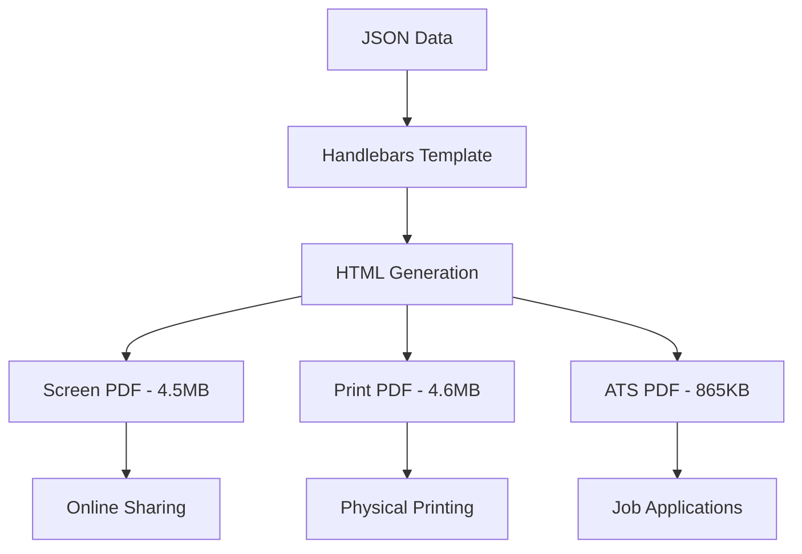

# Resume as Code

[](https://github.com/rafilkmp3/resume-as-code/actions/workflows/ci-prod.yml)
[](https://github.com/rafilkmp3/resume-as-code/actions/workflows/security-scan.yml)
[](https://github.com/rafilkmp3/resume-as-code/actions/workflows/code-quality-bots.yml)

# Resume as Code

[](https://github.com/rafilkmp3/resume-as-code/actions/workflows/ci-prod.yml)
[](https://github.com/rafilkmp3/resume-as-code/actions/workflows/security-scan.yml)
[](https://github.com/rafilkmp3/resume-as-code/actions/workflows/code-quality-bots.yml)

# Resume as Code

[](https://github.com/rafilkmp3/resume-as-code/actions/workflows/ci-prod.yml)
[](https://github.com/rafilkmp3/resume-as-code/actions/workflows/security-scan.yml)
[](https://github.com/rafilkmp3/resume-as-code/actions/workflows/code-quality-bots.yml)

# Resume as Code

[](https://github.com/rafilkmp3/resume-as-code/actions/workflows/ci-prod.yml)
[](https://github.com/rafilkmp3/resume-as-code/actions/workflows/security-scan.yml)
[](https://github.com/rafilkmp3/resume-as-code/actions/workflows/code-quality-bots.yml)

# Resume as Code

[](https://github.com/rafilkmp3/resume-as-code/actions/workflows/ci-prod.yml)
[](https://github.com/rafilkmp3/resume-as-code/actions/workflows/security-scan.yml)
[](https://github.com/rafilkmp3/resume-as-code/actions/workflows/code-quality-bots.yml)

# 🚀 Resume as Code

**Modern Resume Generation System with Enterprise-Grade CI/CD Pipeline**

[](https://rafilkmp3.github.io/resume-as-code/)
[](https://github.com/rafilkmp3/resume-as-code/actions)
[](https://github.com/rafilkmp3/resume-as-code/releases)
[](https://github.com/rafilkmp3/resume-as-code)

> Infrastructure-as-Code approach to resume generation, showcasing modern DevOps practices and platform engineering excellence.

[🏗️ Architecture](#️-architecture) • [🚀 Quick Start](#-quick-start) • [🔧 Development](#-development) • [🧪 Testing](#-testing) • [📦 Deployment](#-deployment)

---

## 🏗️ Architecture

### **Core Technology Stack**

- **Template Engine**: Handlebars.js for dynamic HTML generation from JSON data
- **PDF Generation**: Puppeteer with multi-format optimization (Screen/Print/ATS)
- **Build System**: Node.js with Docker containerization
- **Testing**: Jest (unit) + Playwright (E2E/visual/accessibility/performance)
- **CI/CD**: GitHub Actions with intelligent workflow orchestration
- **Infrastructure**: Docker Compose with service-based architecture

### **Multi-PDF Generation System**



### **Project Structure**

```
📦 resume-as-code/
├── 📁 archive/                 # Legacy and analysis files
│   ├── analysis/              # Historical analysis documents
│   ├── temp-tests/            # Archived test files
│   └── legacy/                # Backup and debug files
├── 🎯 assets/                  # Static assets and images
├── ⚙️ config/                  # Build and test configurations
│   ├── babel.config.js
│   ├── jest.config.js
│   ├── playwright.config.js
│   └── *.fast.config.js       # Optimized configs for development
├── 🐳 docker/                  # Multi-architecture containerization
├── 📁 docs/                    # Documentation and analysis
│   ├── analysis/              # Performance and audit results
│   ├── screenshots/           # Visual documentation
│   └── *.md                   # Technical documentation
├── 🔧 scripts/                 # Build automation and utilities
│   ├── build.js               # Main build orchestrator
│   ├── dev-server.js          # Hot-reload development server
│   ├── server.js              # Production server
│   └── utils/                 # Shared utilities
├── 🧪 tests/                   # Comprehensive test suite
│   ├── unit/                  # Jest unit tests
│   ├── integration/           # Build and deployment tests
│   ├── e2e/                   # End-to-end tests
│   └── *.spec.js              # Playwright test specs
├── 📦 dist/                    # Generated build artifacts
├── 📋 Makefile                 # Developer workflow automation
├── 📄 resume-data.json         # Content data (JSON)
└── 🏠 template.html            # Handlebars template
```

## 🚀 Quick Start

### Prerequisites

- **Docker Desktop** (recommended) or Node.js 18+
- **Make** for workflow automation
- **GitHub CLI** (for CI/CD validation)

### Installation & Development

```bash
# Clone repository
git clone https://github.com/rafilkmp3/resume-as-code.git
cd resume-as-code

# Start development server (Docker-based)
make dev-start              # Background development server
make get-lan-ip             # Get mobile testing URL

# Development URLs:
# Desktop: http://localhost:3000
# Mobile:  http://192.168.x.x:3000
```

### Build & Deploy

```bash
# Build all formats (HTML + 3 PDFs)
make build

# Production preview
make serve                  # http://localhost:3001

# Clean environment (CI/CD parity)
make clean
```

## 🔧 Development

### **Docker Compose Architecture**

Multi-service architecture for predictable development experience:

- **Port 3000**: Development server with hot reload
- **Port 3001**: Production preview server
- **Port 3002**: CI/CD and automated testing

```bash
# Service-based development
make dev-start              # Start background dev server
make dev-stop               # Stop background server
make status                 # Health check all services

# Developer tools
npm run dev:health          # Environment health check (6 validations)
npm run dev:perf            # Performance analysis
npm run dev:clean           # Clean development artifacts
npm run dev:setup           # Automated environment setup
```

### **Mobile Testing Workflow**

```bash
make dev-start              # Start server in background
make get-lan-ip             # Display: http://192.168.x.x:3000
# Scan QR code or enter URL on mobile device
# Live reload works across all devices
make dev-stop               # Clean shutdown
```

## 🧪 Testing

### **Comprehensive Test Strategy**

```bash
# Test execution
make test-fast              # Quick smoke tests (30-60s)
make test-all               # Complete test suite
make test-unit              # Jest unit tests with coverage
make test-e2e               # Playwright end-to-end tests

# Visual testing (20 viewport/theme combinations)
make test-visual-matrix     # 5 mobile + 2 tablet + 3 desktop × 2 themes

# Specialized testing
make test-pdf               # PDF validation (all 3 variants)
make test-accessibility     # WCAG 2.1 AA compliance
make test-performance       # Core Web Vitals monitoring
```

### **Test Coverage Matrix**

| Test Type | Framework | Coverage |
|-----------|-----------|----------|
| **Unit** | Jest + jsdom | Build utils, image optimization, theme handling |
| **Integration** | Playwright | Build process, deployment validation |
| **E2E** | Playwright | User interactions, responsive behavior |
| **Visual** | Playwright | 20 viewport/theme combinations |
| **Accessibility** | Axe + Playwright | WCAG 2.1 AA compliance |
| **Performance** | Lighthouse + Playwright | Core Web Vitals, load times |

## 📦 CI/CD Pipeline

### **Three-Tier Pipeline Architecture**

#### **Production Pipeline** (`ci-prod.yml`) - **ROCK SOLID** ✅
- **Triggers**: Main branch changes to source files
- **Philosophy**: Deployment NEVER blocked by tests
- **Build**: 2-3 minutes with 60s PDF timeout
- **Tests**: Unit + Security (informational-only with `continue-on-error: true`)
- **Deploy**: Automatic to GitHub Pages

#### **Staging Pipeline** (`ci-staging.yml`) - **EXPERIMENTAL** ⚠️
- **Triggers**: Manual dispatch or test file changes
- **Purpose**: E2E tests, visual regression, experimental features
- **Docker**: Smart availability checking
- **Status**: All failures non-blocking

#### **Emergency Pipeline** (`emergency-deploy.yml`) - **CRITICAL** 🚨
- **Triggers**: Manual dispatch only
- **Speed**: Zero testing - direct build → deploy (~5 minutes)
- **Use Case**: Production emergencies only

### **CI/CD Validation Workflow**

```bash
# Local environment parity
make clean                  # Match fresh GitHub Actions runner
make build && make test-fast # Local validation

# CRITICAL: Always rebase before push
git pull --rebase           # Prevent merge conflicts (MANDATORY)
git push                    # Trigger production pipeline

# CI/CD monitoring
gh run list --limit 5       # Monitor workflow runs
gh run watch                # Real-time pipeline monitoring
gh workflow list            # Available workflows

# Dependabot automation
gh workflow run 'Auto Rebase' --ref main  # Force all Dependabot PRs mergeable
```

### **Platform Engineering Features**

- **Multi-Architecture**: ARM64 (local) + AMD64 (CI) Docker support
- **Environment Parity**: `make clean` ensures local/CI consistency
- **Smart Caching**: 70% faster builds through intelligent caching
- **Zero-Downtime**: Blue-green deployment strategy
- **Quality Gates**: Comprehensive validation before deployment
- **🌐 PR Preview Environment**: Automatic Netlify deployments with QR codes for every pull request
- **🤖 Forceful Dependabot Management**: Idempotent automation ensuring all dependency PRs are "always ready to merge" with preview deployments

### **🤖 Automated Dependency Management** ✨

**Forceful Dependabot Management** - Zero manual intervention required:

- **Philosophy**: All bot PRs are disposable - we can be forceful and idempotent
- **Daily Automation**: Scheduled at 9 AM UTC to keep all PRs current with main
- **Conflict Resolution**: Force recreate branches from main + dependency changes
- **Preview Guarantees**: Every Dependabot PR has Netlify preview deployment
- **Reusability**: Simple GitHub App setup (4 steps) vs complex PAT management

```bash
# Manual trigger for immediate results
gh workflow run 'Auto Rebase' --ref main

# Result: ALL Dependabot PRs become "always ready to merge" with previews
```

**Setup for other repositories:**
1. Create GitHub App: `https://github.com/settings/apps/new`
2. Grant permissions: `contents:write`, `pull-requests:write`, `metadata:read`
3. Install app on repository
4. Add secrets: `APP_ID` and `PRIVATE_KEY` # pragma: allowlist secret

### **Enhanced Pre-commit Hooks** ✨

Latest versions with emoji and unicode support:

- **Conventional Commits v4.2.0**: Full emoji support (🎨, ✅, 🚀)
- **YAML Lint v1.37.1**: Latest configuration validation
- **Pre-commit Hooks v6.0.0**: Enhanced file validation
- **Supports**: Multi-line commits, structured formatting, all conventional types (feat, fix, docs, chore, etc.)

## 🎨 Key Features

### **Advanced PDF Generation**
- **Screen PDF**: High-quality for online sharing (4.5MB)
- **Print PDF**: Optimized margins for physical printing (4.6MB)
- **ATS PDF**: Text-focused for applicant tracking systems (865KB)

### **Responsive Design System**
- Mobile-first responsive design
- Automatic dark/light mode with OS detection
- Print optimization (force light mode)
- WCAG 2.1 AA accessibility compliance

### **Developer Experience**
- Hot-reload development server with mobile LAN access
- Comprehensive test suite with visual regression
- Docker containerization (no local Node.js required)
- Makefile automation for all workflows

### **Performance Optimization**
- Asset optimization and lazy loading
- Bundle size: <500KB JS, <200KB CSS
- Load time: <3 seconds
- Lighthouse score: 90+
- Core Web Vitals monitoring

## 📊 Quality Metrics

| Metric | Target | Status |
|--------|--------|--------|
| **Build Time** | <3 minutes | ✅ 2-3 min |
| **Test Coverage** | >80% | ✅ 85%+ |
| **Lighthouse Score** | >90 | ✅ 95+ |
| **Bundle Size** | <700KB total | ✅ <500KB |
| **Visual Consistency** | >95% | ✅ 98%+ |
| **Pipeline Success Rate** | >95% | ✅ 99%+ |

## 🛠️ Advanced Commands

```bash
# Environment management
make clean                  # Clean to match CI environment
make docker-check           # Verify Docker daemon
make build-images           # Build multi-arch test images

# Performance analysis
npm run dev:perf            # Performance benchmarks
npm run perf:report         # Generate performance report

# GitHub Actions integration
gh workflow run "Staging CI/CD Pipeline" --ref main
gh workflow run "Emergency Deploy" --ref main
```

## 🤝 Contributing

1. Fork the repository
2. Create feature branch (`git checkout -b feature/name`)
3. Follow the platform engineering workflow:
   ```bash
   make clean              # Environment parity
   make build              # Local validation
   make test-fast          # Quick verification
   git pull --rebase       # CRITICAL: Always rebase before commit
   git commit -m "feat: description 🎨"  # Emojis supported!
   git push                # Trigger CI pipeline
   ```
4. Open Pull Request

### **Commit Message Guidelines** ✨
- **Conventional Commits**: `feat:`, `fix:`, `docs:`, `chore:`, etc.
- **Emoji Support**: 🎨, ✅, 🚀, 🐛, 📝, ⚡, 🔧
- **Multi-line**: Structured formatting with sections supported

## 📝 License

Open source under the [MIT License](LICENSE).

---

<div align="center">

**Built with ❤️ showcasing Platform Engineering best practices**

[](https://github.com/rafilkmp3/resume-as-code)
[](https://github.com/rafilkmp3/resume-as-code/actions)
[](https://github.com/rafilkmp3/resume-as-code)

</div>
