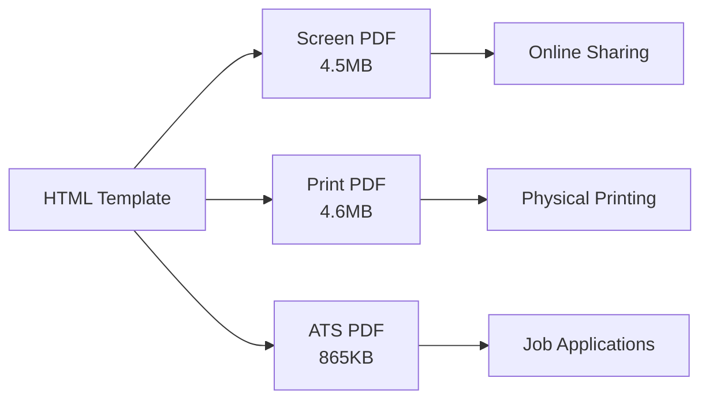

<div align="center">

# 🚀 Resume as Code
### Rafael Bernardo Sathler
**Enterprise-Grade Platform Engineering Portfolio**

[](https://rafilkmp3.github.io/resume-as-code/)
[](https://rafilkmp3.github.io/resume-as-code/resume.pdf)
[](https://github.com/rafilkmp3/resume-as-code/actions)

*Enterprise-grade resume generation showcasing Platform Engineering excellence*

[✨ Features](#-key-features) • [🚀 Quick Start](#-quick-start) • [🔧 Commands](#-commands) • [📱 Preview](#-preview) • [🏗️ Architecture](#️-architecture)

</div>

---

## 🏆 Professional Overview

**11+ years** of Platform Engineering leadership delivering enterprise-scale solutions:

- 🏆 **Guinness World Record** - Zero-downtime infrastructure for record-breaking public votes
- 💰 **$65K+ Annual Savings** through intelligent automation and cost optimization
- 📈 **Enterprise Scale** - Supporting 5,000+ engineers across 8,000+ repositories
- 🚀 **Platform Innovation** - Self-service infrastructure reducing deployment time by 85%
- 🛡️ **Security & Compliance** - Audit-grade systems with enterprise standards
- ⚡ **Performance Excellence** - 99.99% uptime SLAs with sub-second response times

## ✨ Key Features

### 🎨 **Multi-PDF System**
- **Screen PDF** - Beautiful version for online sharing
- **Print PDF** - Optimized for physical printing with enhanced margins
- **ATS PDF** - Simplified, text-focused version for job applications

### 🔧 **Developer Experience**
- Modern Makefile with intuitive commands
- Docker containerization (AMD64 + ARM64 support)
- Hot reload development server
- Comprehensive test suite with CI/CD

### 🎨 **Design & Accessibility**
- Responsive mobile-first design
- Automatic dark/light mode with print optimization
- WCAG 2.1 AA compliance
- Industry-standard UI/UX patterns

### 🧪 **Quality Assurance**
- Unit testing with Jest & comprehensive mocking
- Visual regression testing with baseline protection
- Accessibility testing (WCAG compliance)
- Performance monitoring (Core Web Vitals)
- Multi-architecture Docker support

## 📱 Preview

<div align="center">

| Desktop | Mobile | Dark Mode |
|---------|--------|-----------|
|  |  |  |
| Professional layout | Responsive design | Automatic theming |

<details>
<summary><strong>📊 More Views</strong></summary>

| Tablet | Interactive Elements |
|--------|---------------------|
|  |  |
| Optimized experience | Smooth animations |

</details>

</div>

## 🚀 Quick Start

### Prerequisites
- Node.js 18+, npm 8+, Docker (optional)

### Installation
```bash
# Clone and setup
git clone https://github.com/rafilkmp3/resume-as-code.git
cd resume-as-code && make install

# Start development
make dev
# 🌐 http://localhost:3000
```

### Docker (Multi-Architecture)
```bash
# One-command development (auto-detects ARM64/AMD64)
make docker-dev

# Production environment
make docker-prod
```

## 🔧 Commands

### **Development**
```bash
make build          # Build HTML + 3 PDF versions
make dev            # Hot reload development server
make serve          # Serve built resume
```

### **Testing**
```bash
make test           # Complete test suite
make test-unit      # Unit tests with coverage
make test-e2e       # End-to-end tests (when available)
```

### **Docker**
```bash
make docker-dev     # Development in Docker
make build-images   # Build browser-specific images
make docker-clean   # Clean containers
```

## 🏗️ Architecture

### **Tech Stack**
- **Templating**: Handlebars.js for dynamic generation
- **PDF Generation**: Puppeteer with 3 optimization modes
- **Testing**: Jest (unit) + Playwright (E2E)
- **CI/CD**: GitHub Actions with intelligent workflows
- **Containerization**: Multi-arch Docker support

### **Project Structure**
```
📦 resume-as-code/
├── 🎯 assets/                  # Images and resources
├── ⚙️ config/                  # Testing and build configs
├── 📁 docs/                    # Documentation and screenshots
├── 🐳 docker/                  # Multi-arch containerization
├── 🔧 scripts/                 # Build automation
├── 🧪 tests/                   # Comprehensive test suite
├── 📦 dist/                    # Generated HTML + 3 PDFs
├── 📋 Makefile                 # Developer workflow
├── 📄 resume-data.json         # Content data
└── 🏠 template.html            # Handlebars template
```

### **CI/CD Pipeline**
- **Smart Triggers**: Path-based workflow optimization
- **Multi-Arch Builds**: AMD64 + ARM64 Docker images
- **Quality Gates**: Comprehensive testing before deployment
- **Automated Deployment**: GitHub Pages with CDN
- **Performance**: 70% faster CI through intelligent caching

### **PDF Generation System**


## 🌟 Advanced Features

- **🌓 Smart Theming**: OS detection with manual override, automatic light mode for printing
- **📱 Mobile Sharing**: Native Web Share API for PDFs (AirDrop, WhatsApp, etc.)
- **⚡ Performance**: Asset optimization, lazy loading, efficient bundle sizes
- **🔒 Security**: CSP headers, secure deployment, vulnerability scanning
- **♿ Accessibility**: WCAG 2.1 AA compliant with full keyboard navigation

## 📊 Quality Metrics

- **Load Time**: < 3 seconds
- **Lighthouse Score**: 90+
- **Accessibility**: WCAG 2.1 AA compliant
- **Bundle Size**: < 500KB JS, < 200KB CSS
- **Test Coverage**: 80+ comprehensive tests
- **Visual Consistency**: 98%+ screenshot match

## 🤝 Contributing

This is a personal portfolio, but suggestions are welcome:

1. Fork the repository
2. Create feature branch (`git checkout -b feature/name`)
3. Commit changes (`git commit -m 'Add feature'`)
4. Push branch (`git push origin feature/name`)
5. Open Pull Request

## 📝 License

Open source under the [MIT License](LICENSE).

## 🔗 Connect

- **LinkedIn**: [rafael-sathler](https://www.linkedin.com/in/rafaelbsathler/)  
- **GitHub**: [rafaelbsathler](https://github.com/rafaelbsathler)
- **Email**: [rafaelbsathler@gmail.com](mailto:rafaelbsathler@gmail.com)
- **Schedule**: [calendly.com/rafaelbsathler](http://calendly.com/rafaelbsathler)

---

<div align="center">

**Built with ❤️ using Platform Engineering best practices**

[](https://rafilkmp3.github.io/resume-as-code/)

</div>