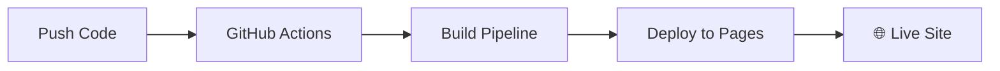

<div align="center">

# 🚀 Resume as Code
### Rafael Bernardo Sathler

**Platform Engineering Portfolio Project**

[](https://rafilkmp3.github.io/resume-as-code/)
[](https://rafilkmp3.github.io/resume-as-code/resume.pdf)
[](https://github.com/rafilkmp3/resume-as-code/actions)

*A modern, automated resume generation system showcasing DevOps and Platform Engineering best practices through infrastructure-as-code principles applied to personal branding.*

[🎯 Features](#-features) • [🛠️ Quick Start](#️-quick-start) • [📋 Commands](#-make-commands-reference) • [🚀 Architecture](#-architecture-highlights) • [🔗 Live Demo](https://rafilkmp3.github.io/resume-as-code/)

</div>

---

This project demonstrates my expertise in **automation**, **CI/CD**, **infrastructure design**, and **developer experience** by creating a fully automated resume platform with professional PDF generation, responsive web design, and streamlined development workflows.

<details>
<summary><strong>🏆 Professional Highlights</strong></summary>

<br>

**11+ years** of Platform Engineering excellence:

- 🏆 **Guinness World Record** - Zero-downtime infrastructure for record-breaking traffic
- 💰 **Major Cost Optimization** - $65K+ annual savings through automation  
- 📈 **Enterprise Scale** - Supporting 5,000+ engineers and 8,000+ repositories
- 🚀 **Platform Leadership** - Building self-service infrastructure at Uber and Bluecore

</details>

## ✨ Technical Showcase

<table>
<tr>
<td width="50%">

**🔧 Developer Experience**
- Comprehensive Makefile with intuitive commands
- Smart port management and conflict resolution
- Live reload and file watching capabilities
- Color-coded build output and status reporting

**⚡ Automation & CI/CD** 
- One-command build, serve, and deployment pipeline
- GitHub Actions for automated deployment
- Continuous integration with quality checks
- Infrastructure-as-code principles

</td>
<td width="50%">

**📄 Document Generation**
- Advanced PDF rendering with Puppeteer
- Print-optimized typography and layouts
- ATS-friendly plain text export
- Cross-platform compatibility

**🎨 Frontend Engineering**
- Responsive design with modern CSS Grid/Flexbox
- Dark/light theme with OS preference detection
- Interactive elements with accessibility support
- Professional UI with gradient animations

</td>
</tr>
</table>

## 🎯 Features

- **📱 Responsive Web Resume**: Mobile-optimized professional layout
- **📄 High-Quality PDF Export**: Print-ready PDF with proper typography  
- **🌙 Dark/Light Theme**: Auto-detecting OS preference with manual override
- **📋 ATS-Friendly Export**: Plain text version for applicant tracking systems
- **🔗 Interactive Elements**: Direct contact links and social profiles with official logos
- **⚡ Fast Development**: Live reload and file watching capabilities
- **📊 Professional Analytics**: Clean, structured data presentation

## 🛠️ Quick Start

> **💡 Tip:** This project uses Make for an enhanced developer experience. All commands are optimized for productivity!

<table>
<tr>
<td width="50%">

### 🚀 Essential Commands

```bash
# 🎯 Get started
make help

# 📦 Setup
make install

# 🏗️ Build & serve  
make dev

# ✨ Live development
make live
```

</td>
<td width="50%">

### 🔧 Utility Commands

```bash
# 📊 Project status
make status

# 🧹 Clean build
make clean

# 📄 Build only
make build

# 🌐 Serve only  
make serve
```

</td>
</tr>
</table>

<details>
<summary><strong>📋 Alternative: Using npm directly</strong></summary>

```bash
npm install          # Install dependencies
npm run build        # Build resume
npm run serve        # Serve locally
```

</details>

## 📁 Project Structure

```
resume-as-code/
├── 📄 resume-data.json      # Structured resume content
├── 🎨 template.html         # Handlebars template with responsive CSS
├── 🏗️ build.js             # Puppeteer PDF generation engine
├── 📋 Makefile             # Developer experience automation
├── 🚀 .github/workflows/   # CI/CD automation
└── 📦 dist/                # Generated artifacts (HTML + PDF)
```

## 🚀 Architecture Highlights

### Build System Design
- **Template Engine**: Handlebars for dynamic content generation
- **PDF Generation**: Puppeteer with optimized print styles for professional output
- **Asset Pipeline**: Automated image copying and resource management
- **Error Handling**: Graceful fallbacks and comprehensive logging

### Developer Experience
- **Smart Port Management**: Automatic process cleanup on port conflicts
- **File Watching**: Real-time rebuild on content changes
- **Color-Coded Output**: Visual feedback for build status
- **Comprehensive Status**: File sizes, port status, and system info

### Production Ready
- **GitHub Pages Integration**: Automated deployment pipeline
- **Performance Optimized**: Efficient asset loading and caching
- **Cross-Platform**: Works on macOS, Linux, and Windows
- **Mobile Responsive**: Tested across devices and screen sizes

<details>
<summary><strong>📋 Complete Make Commands Reference</strong></summary>

<br>

| Command | Description | Use Case |
|---------|-------------|----------|
| `make help` | 📋 Show all available commands | Getting started |
| `make install` | 📦 Install Node.js dependencies | Initial setup |
| `make build` | 🏗️ Generate HTML and PDF | Production build |
| `make dev` | 🚀 Build and serve with port cleanup | Development |
| `make serve` | 🌐 Serve existing build | Quick preview |
| `make live` | ✨ File watching + live reload | Active development |
| `make clean` | 🧹 Remove generated files | Fresh start |
| `make status` | 📊 Project health check | Debugging |
| `make watch` | 👀 Watch files without server | CI/CD usage |

</details>

## 🌐 Deployment

<table>
<tr>
<td width="50%">

### 🚀 Automatic GitHub Pages



**Zero-config deployment:**
1. Push to GitHub
2. GitHub Actions builds automatically  
3. Live at `yourusername.github.io/resume-as-code/`

</td>
<td width="50%">

### 🛠️ Manual Deployment

```bash
# Build for production
make build

# Deploy dist/ folder to:
# - GitHub Pages
# - Netlify
# - Vercel
# - Your hosting platform
```

**Supports any static hosting provider**

</td>
</tr>
</table>

## 🎨 Customization

### Content Updates
Edit `resume-data.json` with your information:
```json
{
  "basics": {
    "name": "Your Name",
    "label": "Your Title",
    "email": "your@email.com"
  }
}
```

### Styling
Modify the `<style>` section in `template.html` for visual customization.

### PDF Output
Adjust print styles in the `@media print` section for PDF-specific formatting.

---

## 🔗 Live Demo & Download

<div align="center">

[](https://rafilkmp3.github.io/resume-as-code/)
[](https://rafilkmp3.github.io/resume-as-code/resume.pdf)

</div>

## 🛡️ Quality Assurance

- **✅ Cross-Browser Testing**: Chrome, Firefox, Safari compatibility
- **📱 Mobile Optimization**: Responsive design across all devices
- **🔍 ATS Compatibility**: Machine-readable format for applicant tracking
- **📄 Print Quality**: Professional PDF output with proper typography
- **⚡ Performance**: Optimized loading and rendering

## 📝 Technical Stack

<div align="center">


</div>

**Core Technologies:**
- **Node.js** - Runtime and build tooling
- **Puppeteer** - Headless Chrome for PDF generation  
- **Handlebars** - Template engine for dynamic content
- **CSS Grid/Flexbox** - Modern responsive layout
- **Make** - Build automation and developer experience
- **GitHub Actions** - CI/CD pipeline

## 🤝 Contributing

This project demonstrates Platform Engineering principles applied to personal branding. Feel free to fork and adapt for your own resume needs!

## 📄 License

MIT License - Feel free to use this project as inspiration for your own resume automation!