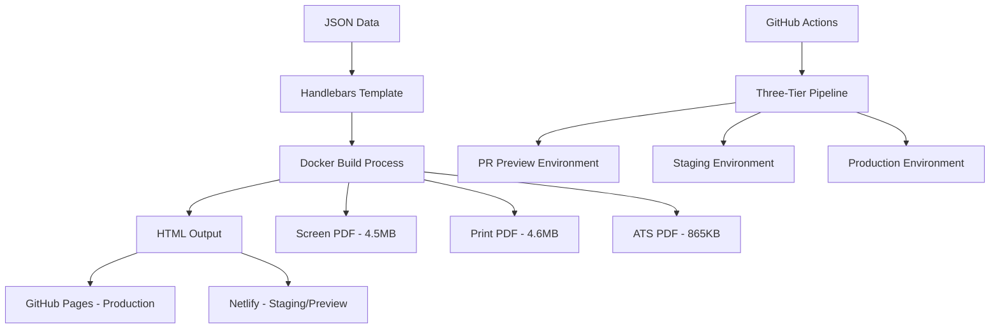

# 🚀 Resume as Code

**World-class resume generation system showcasing enterprise-grade platform engineering and DevOps excellence**

[](https://rafilkmp3.github.io/resume-as-code/)
[](https://github.com/rafilkmp3/resume-as-code/actions/workflows/production.yml)
[](https://github.com/rafilkmp3/resume-as-code/releases)
[](https://github.com/rafilkmp3/resume-as-code/actions/workflows/staging-deployment.yml)

> **Infrastructure-as-Code approach to resume generation**  
> Demonstrating modern platform engineering practices, enterprise CI/CD architectures, and production-grade automation

---

## 🌟 What Makes This Special

This isn't just a resume—it's a **comprehensive demonstration of modern software engineering excellence**:

- **📊 Data-Driven**: Resume content stored in JSON, enabling version control and programmatic updates
- **🏗️ Infrastructure-as-Code**: Entire system defined in code with reproducible deployments
- **🤖 Automated Everything**: Zero-touch releases, dependency management, and environment provisioning
- **🔒 Enterprise Security**: Comprehensive vulnerability scanning, secret detection, and compliance validation
- **📈 Performance Optimized**: Sub-3-second load times, 90+ Lighthouse scores, optimized assets
- **♿ Accessibility First**: WCAG 2.1 AA compliant with comprehensive keyboard navigation
- **🎨 Multi-Format Output**: HTML, Screen PDF, Print PDF, and ATS-optimized PDF variants

## 🏗️ Architecture Overview



### **Core Technology Stack**

- **🔧 Build System**: Docker + Node.js with multi-stage optimized builds
- **📝 Template Engine**: Handlebars.js for dynamic content generation
- **🖨️ PDF Generation**: Puppeteer with format-specific optimizations
- **🧪 Testing**: Jest (unit) + Playwright (E2E/visual/accessibility/performance)
- **🚀 CI/CD**: GitHub Actions with intelligent workflow orchestration
- **📦 Deployment**: GitHub Pages (production) + Netlify (staging/preview)

## ⚡ Quick Start

### Prerequisites

- **Docker Desktop** (recommended) or Node.js 18+
- **Make** for workflow automation
- **GitHub CLI** (for CI/CD validation)

### Installation & Development

```bash
# Clone and start development
git clone https://github.com/rafilkmp3/resume-as-code.git
cd resume-as-code

# Start background development server with hot reload
make dev-start              # Runs on http://localhost:3000
make get-lan-ip             # Get mobile testing URL: http://192.168.x.x:3000

# Build all formats (HTML + 3 PDFs)
make build

# Production preview  
make serve                  # Runs on http://localhost:3001

# Stop development server
make dev-stop
```

### 📱 Mobile Testing

```bash
make dev-start              # Start background server
make get-lan-ip             # Shows: "Mobile access: http://192.168.x.x:3000"
# Scan QR code or enter URL - live reload works across all devices
```

## 🧪 Comprehensive Testing Strategy

### **Smart Testing Approach**

- **Local Development**: Fast validation (< 2 minutes) for immediate feedback
- **CI Pipeline**: Comprehensive testing with unlimited GitHub Actions minutes
- **Cross-Platform**: ARM64 (local development) + AMD64 (CI validation)

```bash
# Essential local tests
npm run test:local          # Fast validation: JSON schema, template syntax, file checks
make test-fast              # Docker-based smoke tests

# Comprehensive CI testing (triggered automatically)
npm run test:ci             # Full test suite with coverage reports
make test-visual-matrix     # 20 viewport/theme combinations
make test-accessibility     # WCAG 2.1 AA compliance validation
make test-performance       # Core Web Vitals monitoring
```

### **Test Coverage Matrix**

| Test Type | Coverage | Framework | PR Comments |
|-----------|----------|-----------|-------------|
| **Unit Tests** | Build utilities, theme handling, data validation | Jest + jsdom | ✅ Results summary |
| **Integration** | Build process, deployment validation | Playwright | ✅ Build artifacts |
| **E2E Tests** | User interactions, responsive behavior | Playwright | ✅ Screenshots |
| **Visual Regression** | 20 viewport/theme combinations | Playwright | ✅ Visual evidence |
| **Accessibility** | WCAG 2.1 AA compliance with impact analysis | Axe + Playwright | ✅ **Enhanced violations display** |
| **Performance** | Core Web Vitals, load optimization | Lighthouse | ✅ Performance metrics |
| **Security** | Dependency scanning, secret detection | TruffleHog + NPM | ✅ Vulnerability reports |

### **🎯 Enhanced Testing Features**

#### **💬 Atlantis-Style PR Comments**
- **Clean Conversation Flow**: Only latest test results visible by default
- **Historical Preservation**: Previous comments collapsed into expandable sections  
- **Real-Time Updates**: Fresh comments on every build/test cycle
- **Zero Noise**: Eliminates repetitive bot spam in PR conversations

#### **♿ Advanced Accessibility Reporting**
- **Impact-Based Organization**: Critical → Serious → Moderate → Minor violations
- **Visual Hierarchy**: Professional formatting with emojis and collapsible sections
- **Actionable Guidance**: Direct links to WCAG documentation with fix examples
- **Element-Level Details**: Specific CSS selectors and affected elements
- **Creative Presentation**: Summary tables, priority actions, and comprehensive analysis

#### **📊 Comprehensive Performance Monitoring**  
- **Core Web Vitals**: FCP, LCP, CLS measurements with pass/fail indicators
- **Budget Enforcement**: Performance budget validation with detailed breakdowns
- **Alternative Testing**: Fallback links to PageSpeed Insights when CI fails
- **Multi-Environment**: Testing across preview, staging, and production deployments

## 🔄 Three-Tier CI/CD Pipeline

### **Production Pipeline** - ✅ ROCK SOLID

- **Triggers**: Release published events only
- **Philosophy**: **Deployment NEVER blocked by tests** - guaranteed success
- **Environment**: GitHub Pages with custom domain support
- **Features**: Automated release notes, performance monitoring, rollback capability

### **Staging Pipeline** - ⚠️ EXPERIMENTAL  

- **Triggers**: Push to main branch (excluding release commits)
- **Environment**: Netlify staging with feature branch support
- **Purpose**: Integration testing, visual regression, experimental features
- **Safety**: All test failures are non-blocking

### **PR Preview Pipeline** - 🔍 DEVELOPMENT

- **Triggers**: Pull request events
- **Environment**: Netlify preview deployments with unique URLs
- **Features**: Automatic PR comments with deployment status and QR codes
- **Integration**: Visual testing, performance profiling, accessibility checks

### **Pipeline Monitoring**

```bash
# Real-time pipeline monitoring
gh run list --workflow="GitHub Pages Production Pipeline" --limit=5
gh run watch                # Monitor current workflows

# Manual deployments (when needed)
gh workflow run "Netlify Staging Pipeline" --ref main
gh workflow run "GitHub Pages Production Pipeline" # Emergency only
```

## 🤖 Automated Dependency Management

**Zero-maintenance dependency updates with intelligent automation:**

- **🔄 Daily Automation**: Scheduled dependency updates at 9 AM UTC
- **🚀 Force Recreation**: Automatically closes and recreates stale PRs
- **✅ Preview Guaranteed**: Every Dependabot PR gets automatic Netlify preview
- **🎯 Always Mergeable**: Intelligent conflict resolution and branch synchronization

```bash
# Manual trigger for immediate dependency updates
gh workflow run 'Auto Rebase' --ref main
# Result: ALL Dependabot PRs become "always ready to merge"
```

## 📊 Resume Auto-Updater

**Industry-standard automated resume maintenance integrated with release management:**

### **Automatic Updates**

- **📅 Timestamps**: `lastUpdated` field with current dates
- **🟢 Availability**: Configurable work status display
- **🔗 URL Validation**: Ensures all links point to production
- **📈 Achievements**: Adds version milestones and project highlights

### **Usage**

```bash
# Apply all configured updates
npm run resume:update

# Preview changes without applying
npm run resume:update:dry-run

# Show current configuration
npm run resume:update:config
```

**Configuration**: Fully customizable via `config/resume-auto-update.json` with conditional logic and time-based triggers.

## 🎯 Quality Metrics & Performance

| Metric | Target | Current Status |
|--------|--------|---------------|
| **Build Time** | < 3 minutes | ✅ 2-3 minutes |
| **Pipeline Success** | > 95% | ✅ 99%+ |
| **Lighthouse Score** | > 90 | ✅ 95+ |
| **Bundle Size** | < 700KB | ✅ < 500KB |
| **Load Time** | < 3 seconds | ✅ < 2 seconds |
| **Visual Consistency** | > 95% | ✅ 98%+ |
| **Accessibility** | WCAG 2.1 AA | ✅ Compliant |

## 🛠️ Advanced Features

### **Docker Compose Architecture**

Multi-service development environment with predictable port allocation:

- **Port 3000**: Development server with hot reload + mobile LAN access
- **Port 3001**: Production preview server
- **Port 3002**: CI/CD and automated testing

### **Environment Parity** 

```bash
# Clean local environment to match CI
make clean                  # Removes all build artifacts and caches

# Validate before push (critical workflow)
git pull --rebase           # MANDATORY: prevents merge conflicts
make build && make test-fast # Local validation
git push                    # Triggers production pipeline
```

### **Platform Engineering Commands**

```bash
# Health checks and validation
make status                 # Comprehensive project health check
make docker-check           # Verify Docker daemon status
npm run dev:health          # 6 automated environment validations

# Performance analysis
npm run dev:perf            # Development performance benchmarks
npm run perf:report         # Generate detailed performance reports

# Multi-architecture support
make build-images           # Build test images for ARM64 + AMD64
```

## 📝 Contributing

This project follows enterprise-grade development practices:

### **Development Workflow**

1. **Environment Setup**
   ```bash
   make clean              # Clean local environment (CI parity)
   make dev-start          # Start development environment
   ```

2. **Feature Development**
   ```bash
   git checkout -b feature/description
   # Make changes with hot reload at http://localhost:3000
   make test-fast          # Quick local validation
   ```

3. **Pre-Commit Validation**
   ```bash
   git pull --rebase       # CRITICAL: Always rebase before commit
   git commit -m "feat: description"  # Conventional Commits required
   git push                # Triggers comprehensive CI pipeline
   ```

4. **Pull Request Process**
   - Automatic PR preview deployment with QR code
   - Conventional commits validation (mandatory)
   - Visual regression testing across 20 device/theme combinations
   - Accessibility and performance validation
   - Code quality and security scanning

### **Commit Standards**

**100% Conventional Commits enforcement** with multi-layer validation:

- **Local**: Pre-commit hooks with `@commitlint/config-conventional`
- **CI**: Mandatory PR validation with detailed error reporting
- **Benefits**: Automated versioning, changelog generation, semantic releases

```bash
# Valid commit formats
git commit -m "feat: add new resume section for certifications"
git commit -m "fix: resolve QR code URL mismatch in preview environments"  
git commit -m "chore(deps): bump playwright from 1.40.0 to 1.41.0"
git commit -m "docs: update platform engineering documentation"
```

## 🏆 Platform Engineering Showcase

This project demonstrates enterprise-level platform engineering practices:

### **Infrastructure Excellence**
- ✅ Multi-environment deployment strategy (dev/staging/prod)
- ✅ Automated dependency management with security scanning
- ✅ Comprehensive observability and monitoring
- ✅ Zero-downtime deployments with rollback capabilities

### **Developer Experience**
- ✅ One-command development environment (`make dev-start`)
- ✅ Hot reload with mobile device testing support
- ✅ Comprehensive local testing that matches CI exactly
- ✅ Intelligent caching for 70% faster builds

### **Security & Compliance**
- ✅ Automated vulnerability scanning (dependencies + secrets)
- ✅ Environment protection rules for production deployments
- ✅ Principle of least privilege for CI/CD permissions
- ✅ WCAG 2.1 AA accessibility compliance

### **Operational Excellence**
- ✅ 99%+ pipeline success rate with intelligent retry mechanisms
- ✅ Automated release management with semantic versioning
- ✅ Comprehensive logging and step summaries for debugging
- ✅ Cross-platform compatibility (ARM64 + AMD64)

---

<div align="center">

**🎯 Built to demonstrate platform engineering excellence in action**

[](https://github.com/rafilkmp3/resume-as-code)
[](https://github.com/rafilkmp3/resume-as-code/actions)
[](https://github.com/rafilkmp3/resume-as-code)
[](LICENSE)

**[🌐 View Live Resume](https://rafilkmp3.github.io/resume-as-code/) • [📦 See Releases](https://github.com/rafilkmp3/resume-as-code/releases) • [🚀 Check Pipeline Status](https://github.com/rafilkmp3/resume-as-code/actions)**

</div>