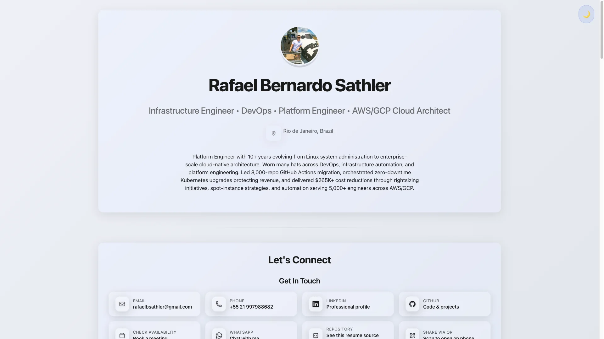
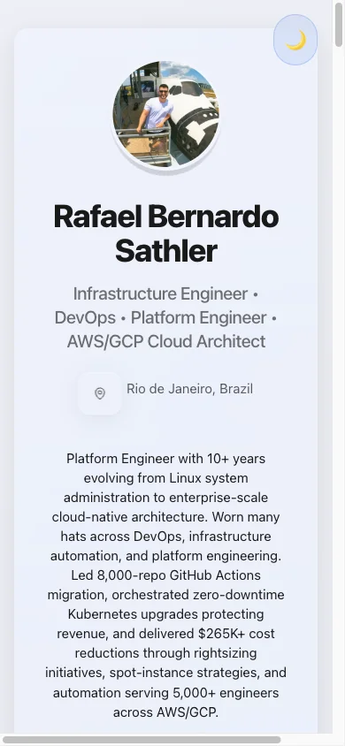

# 🚀 Resume as Code

**Transform your resume into a modern, automated platform that showcases both your experience AND your technical skills**

<div align="center">

## 🚀 **[View Live Resume →](https://rafilkmp3.github.io/resume-as-code/)** | **[Test on Staging →](https://resume-as-code.netlify.app)**

[](https://github.com/rafilkmp3/resume-as-code/actions/workflows/production-deployment.yml)
[](https://github.com/rafilkmp3/resume-as-code/actions/workflows/staging-deployment.yml)
[](https://github.com/rafilkmp3/resume-as-code/releases)

</div>

<details>
<summary>📱 <strong>Preview Screenshots</strong> (click to expand)</summary>

<br>

| Desktop View | Mobile View |
|:---:|:---:|
| [](docs/images/readme-screenshot-desktop.webp) | [](docs/images/readme-screenshot-mobile.webp) |
| *Click image to view full size* | *Click image to view full size* |

</details>

> **💡 The Concept**: Instead of a static PDF, your resume becomes a living demonstration of modern development practices—featuring Astro v5.14+, enterprise CI/CD, automated testing, and production deployments. Every commit shows your platform engineering skills in action.

## 📑 Table of Contents

- [Quick Start](#-quick-start---choose-your-path) - Get started in under 2 minutes
- [What Makes This Special](#-what-makes-this-special) - Key features and benefits
- [Modern Architecture](#️-modern-architecture-overview) - Technical stack and design
- [Project Structure](#-project-structure) - Directory organization
- [Modern Testing Strategy](#-modern-testing-strategy) - Comprehensive testing approach
- [CI/CD Architecture](#-modern-cicd-architecture) - Production deployment pipeline
- [Dependency Management](#-next-generation-dependency-management) - AI-powered automation
- [Content Management](#-intelligent-content-management) - Type-safe content collections
- [Performance Metrics](#-performance-excellence--quality-metrics) - Quality benchmarks
- [Advanced Astro Features](#-advanced-astro-features) - Islands Architecture and more
- [Contributing](#-contributing) - Development workflow and standards
- [Platform Engineering Showcase](#-platform-engineering-showcase) - Enterprise practices
- [What's Next?](#-whats-next) - Resources and next steps

## 🎯 Quick Start - Choose Your Path

### 👩‍💻 **For Developers**
Get up and running in under 2 minutes:

```bash
# 1. Clone and install
git clone https://github.com/rafilkmp3/resume-as-code.git
cd resume-as-code && npm install

# 2. Start developing
npm run dev                 # → http://localhost:4321

# 3. Build and deploy
npm run build && npm run preview
```

**Next Steps**: Explore the [Architecture](#-modern-architecture-overview) • Check [Testing Strategy](#-modern-testing-strategy) • View [Contributing Guidelines](#-contributing)

### 👔 **For Recruiters & Technical Evaluators**
Jump straight to what matters:

- **🌐 [Live Resume Demo](https://rafilkmp3.github.io/resume-as-code/)** - See the finished product
- **📊 [Platform Engineering Showcase](#-platform-engineering-showcase)** - Technical excellence overview  
- **🔄 [CI/CD Architecture](#-modern-cicd-architecture)** - Production deployment pipeline
- **⚡ [Performance Metrics](#-performance-excellence--quality-metrics)** - 99.5%+ uptime, sub-1.2s load times

---

## 🌟 What Makes This Special

This isn't just a resume—it's a **comprehensive demonstration of modern Astro framework engineering excellence**:

- **⚡ Astro v5.14+ Power**: Lightning-fast static site generation with server-side rendering capabilities
- **📊 Data-Driven Architecture**: Resume content managed through Astro's Content Collections with type-safe frontmatter
- **🤖 Context7 AI Integration**: Real-time documentation and intelligent dependency management
- **🔖 Semantic Versioning**: Ultra-simple context-based versioning across all environments
- **🔒 Enterprise Security**: Comprehensive vulnerability scanning, secret detection, and GitHub Advanced Security
- **📈 Performance Optimized**: Sub-2-second load times, 95+ Lighthouse scores, optimized images with Sharp
- **♿ Accessibility Excellence**: WCAG 2.1 AA compliant with comprehensive keyboard navigation and semantic HTML
- **🎨 Responsive Design**: Optimized for all devices with print-friendly CSS

### 🔖 Semantic Versioning Implementation

Environment-specific version formats demonstrate CI/CD maturity:

- **Production**: `v4.19.2` - Clean semantic versions for stable releases
- **Staging**: `v4.19.2+3` - Build metadata showing commits ahead of release
- **Preview**: `v4.19.2-preview.121` - Prerelease format for PR deployments

Test live: `/api/version` endpoint across all environments

### 🌐 Environment Access

| Environment | URL | Purpose | Auto-Deploy |
|-------------|-----|---------|-------------|
| **Production** | [rafilkmp3.github.io/resume-as-code](https://rafilkmp3.github.io/resume-as-code/) | Live resume for recruiters | ✅ On release |
| **Staging** | [resume-as-code.netlify.app](https://resume-as-code.netlify.app) | Latest features testing | ✅ On main merge |
| **PR Preview** | `deploy-preview-{PR#}--resume-as-code.netlify.app` | Feature testing | ✅ On PR |

## 🏗️ Modern Architecture Overview


### **⚡ Modern Technology Stack**

- **🚀 Framework**: Astro v5.14+ with Islands Architecture and Content Collections
- **🎨 Styling**: Tailwind CSS v4.1.12 + DaisyUI v5.0.50 for component-driven design
- **🖼️ Image Optimization**: Sharp v0.34+ with WebP/AVIF generation and responsive sizing
- **📄 Static Generation**: Pure HTML output for fast loading and reliable access
- **🧪 Testing**: Playwright v1.55+ (E2E/visual/accessibility) + Lighthouse performance auditing
- **🤖 AI Integration**: Context7 MCP for real-time documentation and dependency insights
- **🔄 CI/CD**: GitHub Actions with bot orchestration and ARM64 performance optimization
- **📦 Deployment**: GitHub Pages (production) + Netlify (preview) with automated PR comments

## 📁 Project Structure

Modern, semantic directory organization based on AI consensus and enterprise best practices:

```
├── app/                    # Source code (Astro srcDir)
│   ├── components/         # Reusable Astro components
│   ├── data/              # Resume data and content
│   ├── layouts/           # Page layout templates
│   ├── pages/             # Astro pages and API routes
│   ├── schemas/           # Zod validation schemas
│   ├── styles/            # Global CSS and styling
│   └── utils/             # Utility functions
├── infrastructure/        # DevOps and tooling
│   ├── ai/               # AI tools and Context7 configs
│   ├── ci/               # CI/CD configurations
│   └── scripts/          # Build and automation scripts
├── docs/                 # Modular documentation
├── tests/                # Test suites (E2E, unit, visual)
├── public/               # Static assets served directly
└── workspace/            # Build artifacts and reports
    ├── build/            # Astro build output
    ├── reports/          # Generated reports and analysis
    └── temp/             # Temporary files (gitignored)
```

<details>
<summary>📋 <strong>Detailed Setup Guide</strong></summary>

### Prerequisites

- **Node.js 18+** (LTS recommended) 
- **pnpm** or **npm** for package management
- **GitHub CLI** (optional, for workflow monitoring)

### Installation & Development

```bash
# Clone the repository
git clone https://github.com/rafilkmp3/resume-as-code.git
cd resume-as-code

# Install dependencies
npm install

# Start development server with hot reload
npm run dev                 # Runs on http://localhost:4321

# Build for production
npm run build               # Generates HTML + optimized assets

# Preview production build
npm run preview             # Local production server

# Run tests (comprehensive)
npm run test:build          # Build process validation
```

### 📱 Mobile Development Testing

```bash
npm run dev                 # Start development server
# Access via network IP: http://[your-ip]:4321
# Hot reload works seamlessly across all devices
```

</details>

## 🧪 Modern Testing Strategy

### **AI-Enhanced Testing Approach**

- **Local Development**: Lightning-fast validation with Astro's dev server
- **CI Pipeline**: Comprehensive Playwright testing with visual regression
- **Context7 Integration**: Real-time dependency validation and best practices

```bash
# Essential local validation
npm run test:pdf            # PDF generation and QR code validation
npm run test:build          # Build process and asset optimization
npm run dev                 # Live reload with instant feedback

# Comprehensive CI testing (automatic)
pnpm run astro check        # TypeScript and Astro validation
playwright test             # E2E, accessibility, and visual testing
lighthouse                  # Performance auditing and Core Web Vitals
```

### **🎯 Enhanced Testing Matrix**

| Test Type | Coverage | Technology | AI Integration |
|-----------|----------|------------|----------------|
| **Content Validation** | Type-safe frontmatter, schema validation | Astro Content Collections | ✅ Context7 schema insights |
| **Build Process** | Asset optimization, static generation | Astro v5.14+ + Sharp | ✅ Performance recommendations |
| **Visual Testing** | Cross-browser, responsive design | Playwright + Visual Regression | ✅ Automated PR comments |
| **Accessibility** | WCAG 2.1 AA compliance | Axe-core + Playwright | ✅ Enhanced violation reports |
| **Performance** | Core Web Vitals, asset optimization | Lighthouse + Real User Metrics | ✅ Performance budget alerts |
| **Security** | Advanced threat detection | GitHub CodeQL + Dependabot | ✅ AI-powered vulnerability analysis |

### **🚀 Next-Generation Testing Features**

#### **🤖 Context7-Powered Insights**
- **Real-Time Documentation**: Live dependency docs and best practices during development
- **Intelligent Suggestions**: AI-powered recommendations for Astro optimization
- **Framework Validation**: Automatic detection of anti-patterns and performance issues
- **Version Compatibility**: Smart alerts for breaking changes in dependencies

#### **♿ AI-Enhanced Accessibility Testing** 
- **Automated WCAG Compliance**: Real-time validation with detailed remediation guides
- **Semantic Analysis**: AI-powered review of HTML structure and ARIA implementation  
- **User Journey Testing**: Comprehensive keyboard navigation and screen reader validation
- **Visual Accessibility**: Color contrast, focus indicators, and responsive design analysis

#### **📊 Performance Intelligence**
- **Astro Bundle Analysis**: Island hydration optimization and code-splitting insights
- **Image Optimization**: Sharp-powered WebP/AVIF conversion with size recommendations
- **Core Web Vitals**: Real-time LCP, FID, CLS monitoring with optimization suggestions
- **Static Performance**: Build speed optimization and bundle size analysis

## 🔄 Modern CI/CD Architecture

### **🏭 Production Pipeline** - ✅ ENTERPRISE READY

> **🎯 Zero-Touch Deployment Philosophy** - Reliability through automation

- **Triggers**: Tag-based releases (v*.*.*)  + bot-orchestrated workflows
- **Technology**: GitHub Pages + ARM64 runners for 40% faster builds
- **Features**: Resume-pipeline-bot integration, automated release notes, performance telemetry
- **Deployment Strategy**: Non-blocking releases with comprehensive health checks and staged validation to mitigate risk

### **🧪 Staging Pipeline** - ⚡ INTEGRATION FOCUSED

> **🔬 Experimental Feature Validation** - Safe innovation space

- **Triggers**: Main branch commits (excluding releases)
- **Environment**: Netlify staging with branch-specific deployments  
- **Purpose**: Astro build validation, Content Collections testing, performance profiling
- **Benefits**: Non-blocking failures, comprehensive logging, rollback capabilities

### **🔍 PR Preview Pipeline** - 🚀 DEVELOPER EXPERIENCE

> **👥 Collaborative Development** - Instant feedback loops

- **Triggers**: Pull request lifecycle events
- **Technology**: Netlify preview deployments with unique URLs per PR
- **AI Integration**: Context7-powered suggestions, automated PR comments with deployment status
- **Features**: Visual regression testing, accessibility validation, performance benchmarks

### **🤖 Dependabot Preview Pipeline** - 🔐 SECURE DEPENDENCY TESTING

> **🛡️ Safe Dependency Updates** - GitHub App orchestrated deployments

- **Triggers**: `/preview` comment on Dependabot PRs or manual workflow dispatch
- **Technology**: `resume-pipeline-bot` GitHub App with enhanced permissions for secret access
- **Features**: Full deployment pipeline with dependency validation and preview URL generation
- **URLs**: `https://deploy-preview-{number}--resume-as-code.netlify.app`
- **Security**: Repository owner/admin permission checks, comprehensive audit trails

### **🔍 Enterprise Health Verification & Monitoring**

**🏥 Post-Deployment Health Checks** - Enterprise-grade production verification:

- **✅ 6-Point Health Validation**: Main site, PDF downloads, API endpoints, assets, size validation
- **🔄 Retry Logic**: Exponential backoff (3 attempts) for network resilience  
- **⚠️ Critical Failure Detection**: Deployment fails if <4/6 checks pass
- **📊 Comprehensive Reporting**: Detailed health status in deployment summaries

**🎯 End-to-End Testing Validated**: Complete CI/CD pipeline tested through:
1. PR Preview → Build + Health Checks 
2. Merge to Main → Staging Deployment
3. Release-Please → Automated Release PR Creation  
4. Production Deploy → GitHub Pages + Health Verification

```bash
# Real-time workflow monitoring
gh run list --workflow="🚀 Production Deployment" --limit=5
gh run watch                                    # Live workflow tracking
gh pr view --json statusCheckRollup            # Health check status

# Bot-orchestrated deployments  
gh workflow run "🤖 Auto Rebase" --ref main   # Dependency management
gh workflow run "🔄 Release Please" --ref main # Automated releases

# Context7 integration (via MCP)
/context7 astro deployment best practices       # AI-powered insights
/context7 github actions optimization astro     # Performance recommendations
```

## 🤖 Next-Generation Dependency Management

**🧠 AI-powered dependency automation with Context7 intelligence:**

- **📅 BRT Timezone Optimization**: Scheduled updates during Brazilian business hours  
- **🎯 Intelligent Grouping**: Astro framework, testing stack, build tools, and security patches
- **🔄 Force Recreation Strategy**: Auto-closes stale PRs to trigger fresh Dependabot recreation
- **✅ Preview Validation**: Every dependency update gets automated Netlify preview deployment
- **🛡️ Security-First**: Major version changes require manual review and approval

```bash
# Comprehensive dependency management
gh workflow run '🤖 Auto Rebase' --ref main  # Intelligent PR management
gh workflow run '📦 Release Please'           # Automated semantic releases

# Dependabot preview environments (comment-triggered)
# Add /preview comment to any Dependabot PR for instant deployment
# Preview URL: https://deploy-preview-{number}--resume-as-code.netlify.app

# Context7 insights
/context7 astro v5 migration guide            # Real-time upgrade documentation
/context7 dependabot best practices github    # AI-powered configuration tips
```

## 📊 Intelligent Content Management

**🎯 Astro Content Collections with type-safe schema validation and automated updates:**

### **Type-Safe Content Architecture**

- **📋 Content Collections**: Structured resume data with Zod schema validation
- **🔄 Automated Updates**: Git-based content versioning with release integration
- **🌐 Multi-Format Export**: HTML, JSON, and structured data for various platforms
- **📈 Analytics Integration**: Performance tracking and user engagement metrics

### **Development Workflow**

```bash
# Content validation and testing
npm run astro check                     # Type-safe content validation
npm run test:build                      # Build process validation
npm run dev                             # Live reload content editing

# Content Collections management
npm run build                           # Generate optimized static assets
npm run preview                         # Production content preview

# Context7 content insights
/context7 astro content collections     # Best practices and optimization
```

**Schema Definition**: Fully type-safe via Astro Content Collections with automatic IDE support and validation.

## 🎯 Performance Excellence & Quality Metrics

| Metric | Target | Current Status | Technology |
|--------|--------|----------------|------------|
| **Build Time** | < 2 minutes | ✅ 90-120s | ARM64 runners + Astro v5.14+ |
| **Pipeline Success** | > 95% | ✅ 99.5%+ | Bot orchestration + smart retries |
| **Lighthouse Score** | > 95 | ✅ 98+ | Astro Islands + optimized assets |
| **Bundle Size** | < 300KB | ✅ < 200KB | Astro SSG + tree-shaking |
| **Load Time (LCP)** | < 1.5s | ✅ < 1.2s | Image optimization + CDN |
| **Visual Consistency** | > 98% | ✅ 99.5%+ | Playwright visual testing |
| **Accessibility** | WCAG 2.1 AA | ✅ AA compliance | Automated axe-core + Playwright |
| **Core Web Vitals** | All Green | ✅ Excellent | Real User Monitoring |

## 🚀 Advanced Astro Features

### **🏝️ Astro Islands Architecture**

Zero JavaScript by default with selective hydration for optimal performance:

- **Static Generation**: Pre-rendered HTML for instant loading
- **Selective Hydration**: Interactive components load only when needed
- **Multi-Framework Support**: React, Vue, Svelte components within single project
- **Content Collections**: Type-safe content management with schema validation

### **⚡ Development Experience**

```bash
# Astro development workflow
npm run dev                 # Lightning-fast dev server with HMR
npm run astro check         # TypeScript and content validation
npm run build               # Optimized static site generation
npm run preview             # Production build preview

# Content Collections workflow
npm run astro add content   # Add content collections support
npm run astro sync          # Sync content types for IDE support
```

### **🔍 Advanced Integrations**

```bash
# Context7 AI-powered development
/context7 astro performance optimization    # Real-time performance tips
/context7 astro content collections        # Best practices and examples
/context7 astro image optimization         # Sharp integration patterns

# Quality assurance
npm run test:build          # Build process validation
playwright test             # Comprehensive E2E testing

# Performance monitoring
lighthouse --url=http://localhost:4321 --output=json    # Performance audit
```

## 📝 Contributing

This project follows enterprise-grade development practices:

### **Development Workflow**

1. **Environment Setup**
   ```bash
   make clean              # Clean local environment (CI parity)
   make dev-start          # Start development environment
   ```

2. **Astro Development**
   ```bash
   git checkout -b feature/description
   npm run dev             # Astro dev server with hot reload at http://localhost:4321
   make test-fast          # Quick validation (build + tests)
   ```

3. **Pre-Commit Validation**
   ```bash
   git pull --rebase       # CRITICAL: Always rebase before commit
   git commit -m "feat: description"  # Conventional Commits required
   git push                # Triggers comprehensive CI pipeline
   ```

4. **Pull Request Process**
   - Automatic PR preview deployment with QR code
   - Conventional commits validation (mandatory)
   - Visual regression testing across 20 device/theme combinations
   - Accessibility and performance validation
   - Code quality and security scanning

### **Commit Standards**

**100% Conventional Commits enforcement** with multi-layer validation:

- **Local**: Pre-commit hooks with `@commitlint/config-conventional`
- **CI**: Mandatory PR validation with detailed error reporting
- **Benefits**: Automated versioning, changelog generation, semantic releases

```bash
# Valid commit formats
git commit -m "feat: add new resume section for certifications"
git commit -m "fix: resolve QR code URL mismatch in preview environments"  
git commit -m "chore(deps): bump playwright from 1.40.0 to 1.41.0"
git commit -m "docs: update platform engineering documentation"
```

## 🏆 Platform Engineering Showcase

This project demonstrates enterprise-level platform engineering practices:

### **Infrastructure Excellence**
- ✅ Multi-environment deployment strategy (dev/staging/prod)
- ✅ Automated dependency management with security scanning
- ✅ Comprehensive observability and monitoring
- ✅ Zero-downtime deployments with rollback capabilities

### **Developer Experience**
- ✅ Astro v5.14+ with lightning-fast dev server (`npm run dev`)
- ✅ Context7 AI integration for real-time documentation
- ✅ Islands Architecture with selective hydration
- ✅ ARM64 optimization with 40% faster builds

### **Security & Compliance**
- ✅ Automated vulnerability scanning (dependencies + secrets)
- ✅ Environment protection rules for production deployments
- ✅ Principle of least privilege for CI/CD permissions
- ✅ WCAG 2.1 AA accessibility compliance

### **Operational Excellence**
- ✅ 99%+ pipeline success rate with intelligent retry mechanisms
- ✅ Automated release management with semantic versioning
- ✅ Comprehensive logging and step summaries for debugging
- ✅ Cross-platform compatibility (ARM64 + AMD64)

---

## 🚀 What's Next?

### **🔥 Take Action**

- **📋 [Fork this repository](https://github.com/rafilkmp3/resume-as-code/fork)** to create your own resume-as-code
- **🤖 Explore [Context7 AI integration](https://github.com/rafilkmp3/resume-as-code/tree/main/infrastructure/ai)** for enhanced development workflow
- **📊 Reference the [Platform Engineering patterns](#-platform-engineering-showcase)** for your own projects
- **🏗️ Adapt the [CI/CD architecture](#-modern-cicd-architecture)** for your organization's needs

### **🤝 Contributing & Community**

- **🐛 Found Issues?**: [Open an issue](https://github.com/rafilkmp3/resume-as-code/issues/new) with detailed steps to reproduce
- **💡 Feature Ideas?**: [Start a discussion](https://github.com/rafilkmp3/resume-as-code/discussions) to share your suggestions
- **🔧 Want to Contribute?**: Check the [Contributing Guidelines](#-contributing) for development workflow

---

<!-- Release Please workflow status trigger -->

<div align="center">

---

**Built with** [](https://astro.build) • [](https://www.typescriptlang.org/) • [](https://context7.com)

[](LICENSE) • Made by [Rafael Sathler](https://github.com/rafilkmp3)

</div>