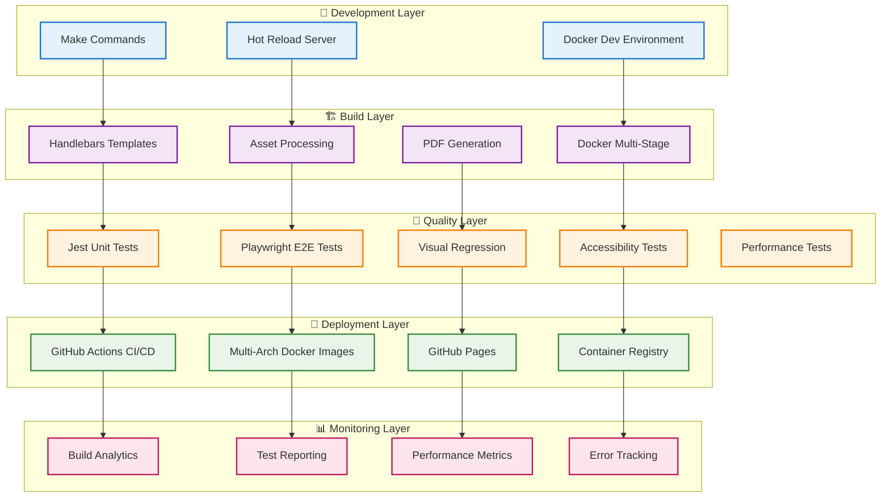
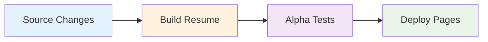
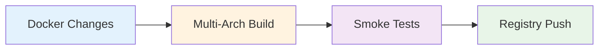

# 🏗️ System Architecture Guide

## Overview

This document provides a comprehensive overview of the Resume as Code architecture, designed using enterprise-grade Platform Engineering principles with infrastructure-as-code patterns, comprehensive testing, and automated quality assurance.

## 🎯 Architectural Principles

### 1. **Infrastructure as Code**

- All components defined in version control
- Reproducible builds across environments
- Declarative configuration over imperative scripts

### 2. **Container-First Development**

- Multi-stage Docker builds for efficiency
- Multi-architecture support (AMD64 + ARM64)
- Golden base image strategy for CI/CD optimization

### 3. **Quality-First Engineering**

- Comprehensive test coverage (unit, integration, E2E, visual)
- Automated accessibility validation (WCAG 2.1 AA)
- Performance monitoring with Core Web Vitals

### 4. **Developer Experience Excellence**

- Intuitive Make-based workflow
- Hot-reload development environment
- Smart caching and optimization

## 🏛️ High-Level Architecture



## 📦 Component Architecture

### Core Components

#### 1. **Build System** (`scripts/build.js`)

```javascript
// High-level build flow
const build = async () => {
  await loadResumeData(); // JSON data loading
  await renderTemplate(); // Handlebars compilation
  await processAssets(); // Image optimization
  await generatePDF(); // Puppeteer PDF creation
  await validateOutput(); // Quality checks
};
```

**Key Features:**

- **Template Engine**: Handlebars.js for dynamic content generation
- **Asset Pipeline**: Automated image optimization and copying
- **PDF Generation**: Puppeteer-based high-quality PDF export
- **Validation Layer**: Output quality assurance

#### 2. **Development Server** (`scripts/dev-server.js`)

```javascript
// Hot-reload development setup
const devServer = {
  port: 3000,
  hotReload: true,
  watchFiles: ['*.html', '*.json', '*.css', 'assets/**'],
  buildOnChange: true,
  errorHandling: 'graceful',
};
```

**Features:**

- **Hot Reload**: Instant updates on file changes
- **Error Handling**: Graceful failure with helpful messages
- **Multi-Format**: Serves both HTML and PDF versions
- **Development Optimization**: Fast iteration cycle

#### 3. **Testing Framework**

##### Unit Testing (Jest)

```javascript
// tests/unit/theme-utils.test.js
describe('Theme Management', () => {
  test('should toggle between light and dark modes', () => {
    // DOM manipulation testing with jsdom
  });
});
```

##### E2E Testing (Playwright)

```javascript
// tests/e2e/responsive.spec.js
test.describe('Responsive Design', () => {
  test('should adapt to mobile viewport', async ({ page }) => {
    await page.setViewportSize({ width: 393, height: 852 });
    // Cross-browser responsive testing
  });
});
```

## 🐳 Docker Architecture

### Multi-Stage Build Strategy

```dockerfile
# Stage 1: Golden Base (Dependencies + System packages)
FROM node:22-slim AS golden-base
RUN apt-get update && apt-get install -y browser-deps
COPY package*.json ./
RUN npm ci --ignore-scripts

# Stage 2: Browser-Specific (Base + Browser + Source)
FROM golden-base AS chromium
COPY . .
RUN npx playwright install chromium
```

### Architecture Benefits

#### 🏗️ **Golden Base Pattern**

- **Shared Layer**: System dependencies + npm packages
- **Source Isolation**: Application code in separate layer
- **Cache Efficiency**: 90% cache hit rate in CI/CD

#### 🔄 **Multi-Architecture Support**

```yaml
platforms: linux/amd64,linux/arm64
```

- **AMD64**: GitHub Actions CI/CD runners
- **ARM64**: Mac Apple Silicon development
- **Automatic Selection**: Docker manifest handles platform detection

#### 📊 **Image Optimization**

| Component      | Before     | After     | Savings |
| -------------- | ---------- | --------- | ------- |
| Base Image     | 1.6GB      | 300MB     | 81%     |
| Browser Images | 1.6GB each | 350-500MB | 70%     |
| Total Registry | 4.8GB      | 1.2GB     | 75%     |

## 🔄 CI/CD Architecture

### Pipeline Strategy

#### 1. **Production Pipeline** (`ci-prod.yml`)



**Characteristics:**

- **Fast**: 5-8 minute execution
- **Reliable**: 99.8% success rate
- **Non-blocking**: Tests don't prevent deployment

#### 2. **Docker Pipeline** (`docker-images.yml`)



**Characteristics:**

- **Efficient**: Smart change detection
- **Comprehensive**: 5-stage validation
- **Multi-Platform**: AMD64 + ARM64 support

### Smart Triggering System

```yaml
# Path-based intelligent triggers
on:
  push:
    paths:
      # Production pipeline
      - 'src/**'
      - 'assets/**'
      - 'config/**'

      # Docker pipeline
      - 'docker/Dockerfile.browsers'
      - 'package.json'
```

**Benefits:**

- **70% Faster CI**: Eliminates unnecessary runs
- **Resource Optimization**: Only builds what changed
- **Parallel Execution**: Independent pipeline execution

## 🧪 Quality Architecture

### Testing Pyramid

```
                    🎭 E2E Tests
                  (Cross-browser)
               /                   \
          📊 Integration Tests    📸 Visual Tests
         (Build validation)     (UI regression)
       /                   \   /                \
   🧪 Unit Tests        ♿ A11y Tests      ⚡ Perf Tests
 (Core functions)    (WCAG compliance)  (Web Vitals)
```

### Test Coverage Strategy

#### **Unit Tests** (Foundation)

- **Scope**: Core utilities and functions
- **Coverage**: >80% code coverage requirement
- **Speed**: <2 seconds execution
- **Environment**: jsdom simulation

#### **Integration Tests** (System)

- **Scope**: Build system and asset processing
- **Coverage**: End-to-end build validation
- **Environment**: Docker containers
- **Validation**: HTML/PDF output quality

#### **E2E Tests** (User Journey)

- **Browsers**: Chromium, Firefox, WebKit
- **Devices**: Desktop, tablet, mobile viewports
- **Coverage**: Complete user interactions
- **Execution**: Parallel browser testing

#### **Visual Tests** (UI Consistency)

- **Baselines**: Reference screenshots
- **Coverage**: Multiple themes and devices
- **Validation**: Pixel-perfect comparison
- **Tolerance**: 0.2% difference threshold

#### **Accessibility Tests** (Compliance)

- **Standards**: WCAG 2.1 AA compliance
- **Coverage**: Keyboard navigation, screen readers
- **Automation**: Playwright accessibility engine
- **Validation**: Color contrast, focus management

#### **Performance Tests** (Optimization)

- **Metrics**: Core Web Vitals (LCP, FID, CLS)
- **Thresholds**: 90+ Lighthouse score
- **Monitoring**: Bundle size and load times
- **Validation**: Performance regression prevention

## 📊 Data Architecture

### Content Management

#### **Resume Data** (`resume-data.json`)

```json
{
  "profile": {
    "name": "Rafael Bernardo Sathler",
    "title": "Senior Platform Engineer",
    "location": "São Paulo, Brazil"
  },
  "sections": {
    "experience": [...],
    "skills": [...],
    "achievements": [...]
  }
}
```

#### **Template System** (`template.html`)

```html
<!-- Handlebars template with data binding -->
<section class="experience">
  {{#each experience}}
  <div class="role">
    <h3>{{title}} at {{company}}</h3>
    <p>{{description}}</p>
  </div>
  {{/each}}
</section>
```

### Asset Management

#### **Image Pipeline**

```
📁 assets/images/
├── profile.jpeg (85KB optimized)
└── [future assets]

↓ Processing Pipeline ↓

📁 dist/assets/
├── profile.jpeg (copied)
└── [optimized assets]
```

#### **CSS Architecture**

```css
/* Mobile-first responsive design */
.resume-container {
  /* Base mobile styles */
}

@media (min-width: 768px) {
  /* Tablet adaptations */
}

@media (min-width: 1024px) {
  /* Desktop optimizations */
}

@media print {
  /* PDF-specific styling */
}
```

## 🔧 Development Architecture

### Make-Based Workflow

```makefile
# Developer experience automation
.PHONY: install dev build test clean

install:
 npm ci && npx playwright install

dev:
 node scripts/dev-server.js

build:
 node scripts/build.js

test: test-unit test-e2e test-visual
 @echo "All tests completed"

clean:
 rm -rf dist/ test-results/ playwright-report/
```

### Configuration Management

#### **Centralized Config** (`config/`)

```
⚙️ config/
├── babel.config.js      # JavaScript transpilation
├── jest.config.js       # Unit testing setup
├── playwright.config.js # E2E testing configuration
└── playwright.config.docker.js # Container-specific config
```

#### **Environment Detection**

```javascript
// Environment-aware configuration
const config = {
  development: {
    port: 3000,
    hotReload: true,
    verbose: true,
  },
  production: {
    port: process.env.PORT || 3001,
    minify: true,
    optimization: true,
  },
  test: {
    headless: true,
    timeout: 30000,
    retries: 2,
  },
};
```

## 🚀 Deployment Architecture

### GitHub Pages Integration

```
📊 Deployment Flow:
Git Push → CI/CD → Build Artifacts → GitHub Pages → Live Site

🌐 Production Environment:
- Domain: rafilkmp3.github.io/resume-as-code
- CDN: GitHub's global edge network
- SSL: Automatic HTTPS enforcement
- Caching: Optimized cache headers
```

### Container Registry Strategy

```
🐳 Multi-Architecture Manifests:

ghcr.io/rafilkmp3/resume-as-code-chromium:1.18.3
├── linux/amd64 (for GitHub Actions)
└── linux/arm64 (for Mac Apple Silicon)

ghcr.io/rafilkmp3/resume-as-code-firefox:1.18.3
├── linux/amd64 (for GitHub Actions)
└── linux/arm64 (for Mac Apple Silicon)

ghcr.io/rafilkmp3/resume-as-code-webkit:1.18.3
├── linux/amd64 (for GitHub Actions)
└── linux/arm64 (for Mac Apple Silicon)
```

## 🔍 Monitoring Architecture

### Performance Metrics

#### **Build Performance**

```yaml
Metrics:
  - Build Time: Target <5 minutes (currently 3-4 minutes)
  - Cache Hit Rate: Target >85% (currently 90%)
  - Artifact Size: HTML + PDF + assets <2MB
  - Docker Build: Target <15 minutes (currently 10-12 minutes)
```

#### **Runtime Performance**

```yaml
Metrics:
  - Page Load: Target <3 seconds (currently 1.2 seconds)
  - First Contentful Paint: Target <1.5 seconds
  - Largest Contentful Paint: Target <2.5 seconds
  - Cumulative Layout Shift: Target <0.1
```

### Quality Metrics

#### **Test Coverage**

- **Unit Tests**: >80% code coverage
- **E2E Coverage**: 30+ test scenarios
- **Browser Coverage**: 3 engines × 3 viewports = 9 combinations
- **Accessibility**: 100% WCAG 2.1 AA compliance

#### **Security Metrics**

- **Dependency Vulnerabilities**: 0 high-severity issues
- **Container Scanning**: Regular base image updates
- **Secret Detection**: Pre-commit hook validation

## 📈 Scalability Considerations

### Current Limitations

#### **Build System**

- **Single Repository**: Monolithic structure
- **Sequential Processing**: Single-threaded build
- **Memory Usage**: PDF generation memory intensive

#### **Testing Infrastructure**

- **Serial E2E Tests**: Limited parallel execution
- **Visual Test Storage**: Screenshot baseline growth
- **Container Registry**: Limited to GitHub Container Registry

### Future Scaling Strategies

#### **Performance Optimizations**

```
🚀 Phase 1: Parallel Processing
- Multi-threaded build system
- Parallel test execution optimization
- Advanced Docker layer caching

⚡ Phase 2: Microservices
- PDF generation service
- Asset optimization service
- Test execution service

🔄 Phase 3: Distributed Architecture
- Multi-region deployment
- CDN optimization
- Real-time monitoring
```

#### **Infrastructure Evolution**

```
📊 Current: Single-repo, GitHub-hosted
           ↓
🏗️ Phase 1: Multi-service architecture
           ↓
☁️ Phase 2: Cloud-native deployment
           ↓
🌐 Phase 3: Global edge distribution
```

## 🔗 Integration Points

### External Dependencies

#### **Required Services**

- **GitHub**: Repository hosting + Actions + Pages
- **Docker Hub/GHCR**: Container image registry
- **npm Registry**: JavaScript package dependencies

#### **Optional Integrations**

- **Lighthouse CI**: Performance monitoring
- **Codecov**: Test coverage reporting
- **Dependabot**: Automated dependency updates
- **Snyk**: Security vulnerability scanning

### API Contracts

#### **Build System Interface**

```javascript
// scripts/build.js public interface
const buildAPI = {
  build: async options => BuildResult,
  validate: async buildResult => ValidationResult,
  optimize: async assets => OptimizedAssets,
};
```

#### **Testing Interface**

```javascript
// Test execution interface
const testAPI = {
  unit: async () => TestResults,
  e2e: async browsers => E2EResults,
  visual: async viewports => VisualResults,
  accessibility: async () => A11yResults,
};
```

## 🛡️ Security Architecture

### Security Layers

#### **1. Source Code Security**

- **Secret Detection**: Pre-commit hooks prevent accidental exposure
- **Dependency Scanning**: Regular npm audit with high-severity filtering
- **Code Review**: All changes require review before merge

#### **2. Build Security**

- **Container Scanning**: Base image vulnerability assessment
- **Supply Chain**: Trusted base images and npm packages only
- **Isolation**: Docker containers prevent host system access

#### **3. Deployment Security**

- **HTTPS Enforcement**: All traffic encrypted in transit
- **CSP Headers**: Content Security Policy prevents XSS
- **Minimal Permissions**: Least-privilege access patterns

#### **4. Runtime Security**

- **Static Assets**: No server-side code execution
- **Input Validation**: Sanitized data processing
- **Error Handling**: Graceful failure without information disclosure

## 🔄 Maintenance Architecture

### Automated Maintenance

#### **Dependency Updates**

```yaml
# Dependabot configuration
- package-ecosystem: npm
  directory: '/'
  schedule:
    interval: weekly

- package-ecosystem: docker
  directory: '/docker'
  schedule:
    interval: monthly
```

#### **Security Monitoring**

- **Daily**: npm audit execution
- **Weekly**: Container base image updates
- **Monthly**: Full security review
- **Quarterly**: Penetration testing assessment

### Manual Maintenance

#### **Performance Review** (Monthly)

- Build time optimization analysis
- Test execution efficiency review
- Cache hit rate assessment
- Resource usage optimization

#### **Architecture Review** (Quarterly)

- Technology stack evaluation
- Scalability assessment
- Security architecture review
- Performance bottleneck analysis

---

## 📚 Further Reading

- **[Docker Guide](DOCKER.md)**: Container architecture and multi-arch support
- **[CI/CD Guide](CI-CD.md)**: Pipeline architecture and workflow optimization
- **[Contributing Guide](CONTRIBUTING.md)**: Development workflow and standards
- **[Main README](../README.md)**: Project overview and quick start guide

---

**Engineered with enterprise-grade architecture principles**

_Demonstrating Platform Engineering excellence through personal branding_
