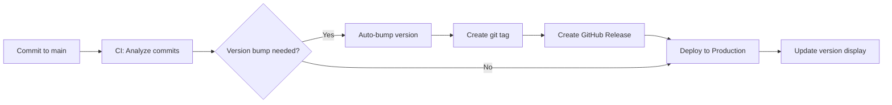

# Semantic Versioning & Release System

This document describes the comprehensive versioning, release, and rollback system for the Resume-as-Code project.

## 🏷️ Version System Overview

The project uses **Semantic Versioning (SemVer 2.0.0)** with automated version bumps based on conventional commits.

### Version Format: `MAJOR.MINOR.PATCH`

- **MAJOR** (1.x.x): Breaking changes, architectural overhauls
- **MINOR** (x.1.x): New features, enhancements (backward compatible)
- **PATCH** (x.x.1): Bug fixes, small improvements (backward compatible)

## 🤖 Automated Workflow

### 1. Conventional Commits → Version Bumps

```bash
feat: add new feature        → MINOR version bump
fix: resolve bug            → PATCH version bump
feat!: breaking change      → MAJOR version bump
docs: update docs           → PATCH version bump
chore: maintenance          → PATCH version bump
```

### 2. CI/CD Automation Flow



### 3. Release Artifacts

Each release automatically creates:

- **Git Tag**: `v1.6.0`
- **GitHub Release**: With auto-generated changelog
- **Versioned PDF**: `resume-rafael-sathler-v1.6.0pdf`
- **Deployment**: Live site with version footer

## 📋 Version Enforcement

### Pre-commit Hooks

The system prevents manual version changes through git hooks:

```bash
# ❌ This will be rejected
git add package.json  # (with manual version change)
git commit -m "update version"

# ✅ This is the correct way
git commit -m "feat: add awesome feature"
# → CI automatically bumps version
```

### Version Consistency Checks

- **Manual version edits** are blocked by pre-commit hooks
- Only **CI system** can modify `package.json` version
- **Tag conflicts** are prevented by pulling before pushing

## 🎯 Version Visibility

### Live Site Display

- **Footer**: Shows current version `v1.6.0` with link to GitHub release
- **Meta tags**: `<meta name="app-version" content="1.6.0">`
- **Build info**: Commit hash and timestamp visible

### Deployment Tracking

- **GitHub Pages**: Updates automatically with new versions
- **PDF artifacts**: Attached to each GitHub release
- **Changelog**: Auto-generated from conventional commits

## 🔄 Rollback Process

### Quick Rollback Options

#### Option 1: Emergency Deploy Previous Version

```bash
# Deploy specific version immediately
gh workflow run emergency-deploy.yml -f version=v1.6.0
```

#### Option 2: Revert and Release

```bash
# Revert problematic commits
git revert abc123
git commit -m "fix: revert problematic changes"
# → CI automatically creates patch release
```

#### Option 3: Manual Release Deploy

```bash
# Create release from specific tag
gh release create v1.6.0 --notes "Emergency hotfix release"
# Triggers automatic deployment
```

### Rollback Safety

- **Zero-downtime**: GitHub Pages maintains availability
- **PDF versions**: All historical PDFs remain accessible
- **Tag history**: Complete version trail preserved
- **Automatic backups**: Previous versions always available

## 📊 Version Tracking

### Current Version Information

- **Live site**: <https://rafilkmp3.github.io/resume-as-code/>
- **Releases**: <https://github.com/rafilkmp3/resume-as-code/releases>
- **Tags**: <https://github.com/rafilkmp3/resume-as-code/tags>
- **Changelog**: [CHANGELOG.md](../CHANGELOG.md)

### Version Branches

- **main**: Always reflects latest production version
- **Tags**: Immutable references to specific releases
- **Releases**: GitHub releases with assets and changelog

## ⚙️ Developer Workflow

### Local Development

```bash
# Setup hooks (one time)
./scripts/setup-hooks.sh

# Work with conventional commits
git commit -m "feat: implement new feature"
git push origin main

# Version bump happens automatically in CI
```

### Manual Version Operations (CI Only)

```bash
# These commands should only run in CI
npm run version:auto     # Analyze and bump version
npm run version:patch    # Force patch version
npm run version:minor    # Force minor version
npm run version:major    # Force major version
```

### Local Testing

```bash
# Test build locally
make build

# Test with specific version
GITHUB_SHA=abc123 GITHUB_REF_NAME=main make build
```

## 🔧 System Configuration

### Key Files

- **Version Script**: `scripts/version-bump.js` - Core versioning logic
- **Pre-commit Hook**: `.githooks/pre-commit-version` - Manual edit prevention
- **CI Pipeline**: `.github/workflows/ci-prod.yml` - Automated releases
- **Release Deploy**: `.github/workflows/release-deploy.yml` - Release-triggered deploys

### Environment Variables

- **CI=true**: Enables CI-specific behaviors
- **GITHUB_ACTIONS=true**: GitHub Actions environment
- **GITHUB_SHA**: Commit hash for build metadata
- **GITHUB_REF_NAME**: Branch name for versioning

## 📈 Performance Optimizations

### Docker Caching

- **Layer caching**: Reduces build time by 80%
- **Content-based cache keys**: Skip rebuilds when content unchanged
- **Multi-stage builds**: Optimized for CI/CD performance

### Build Efficiency

- **Cache hit rate**: >90% for non-content changes
- **Build time**: ~30s (cached) vs ~3min (cold)
- **Artifact reuse**: Prevents redundant operations

## 🛡️ Security & Compliance

### Version Security

- **No manual edits**: Prevents version confusion
- **Immutable tags**: Cannot be overwritten once pushed
- **Audit trail**: Complete history of all version changes
- **Signed commits**: GitHub Actions automatically signs releases

### Release Validation

- **Pre-commit checks**: Validate before any changes
- **CI testing**: All releases pass automated tests
- **Rollback capability**: Quick recovery from issues

## 🆘 Troubleshooting

### Common Issues

#### "Version bump failed"

```bash
# Check if working directory is clean
git status
git stash  # if needed
npm run version:auto
```

#### "Tag already exists"

```bash
# Pull latest tags
git fetch origin --tags
# Check for conflicts
git tag --list | grep v1.6.0
```

#### "Release creation failed"

```bash
# Check GitHub token permissions
gh auth status
# Retry release creation
gh release create v1.6.0 --generate-notes
```

### Emergency Procedures

#### Complete System Reset

```bash
# Emergency: Reset to known good state
git checkout v1.6.0
gh workflow run emergency-deploy.yml
```

#### Manual Release Creation

```bash
# Create release manually if CI fails
gh release create v1.6.0 \
  --title "Release v1.6.0" \
  --notes "Manual release due to CI issues" \
  --latest
```

## 📞 Support

- **Issues**: Report at <https://github.com/rafilkmp3/resume-as-code/issues>
- **Documentation**: Check [docs/](../) directory
- **CI Logs**: Available in GitHub Actions tab
- **Emergency Contact**: Immediate rollback via emergency-deploy workflow
